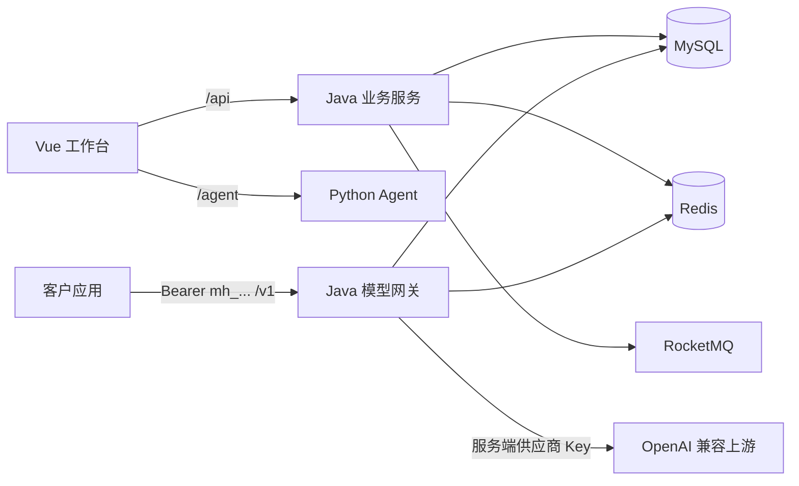

# 前端与模型调用网关说明

## 1. 这次补全的使用闭环

用户可以在 Vue 工作台完成以下流程：

1. 手机号验证码登录或注册。
2. 浏览模型目录和套餐，创建普通套餐订单或秒杀订单。
3. 在本地演示环境显式确认模拟支付，到账后查看可用、已用和调用中预留额度。
4. 创建只显示一次明文的平台 API Key。
5. 在模型体验页调用真实上游，或使用 `/v1/chat/completions` 接入自己的应用。
6. 查看调用量、估算成本、请求状态和需要人工核对的异常调用。
7. 在智能助手页访问 Python Agent，进行选型、成本、套餐和排障咨询。

模型调用和 Agent 咨询是两条独立链路。模型调用由 Java 网关统一鉴权、限流和扣减套餐 Token；Agent 使用 `token-agent` 自己配置的模型和工具，不扣减 Java 侧套餐额度。

## 2. 运行架构

供应商 Key 只存在于 Java 服务端环境变量。浏览器获得的是 ModelHub 平台 Key，两者不能互换。

## 3. 数据库迁移

新环境先执行 `db/modelhub.sql`，再执行 `db/gateway-migration.sql`。已有环境只执行后者，迁移会：

- 为 `tb_token_account` 增加 `reserved_quota`，记录调用中或结果不确定的冻结额度。
- 创建 `tb_gateway_api_key`，仅保存平台 Key 的 SHA-256 哈希、前缀和使用时间。
- 创建 `tb_gateway_usage`，保存幂等键、真实 usage、结算状态和受大小限制的成功响应，用于安全重放。

迁移脚本不会清空已有账户、订单或额度记录。

## 4. 配置真实模型

Java 服务在 `application.yaml` 中提供百炼工作空间地址、上游模型名称和模型目录 `id=1` 的默认值，也可以用以下环境变量覆盖：

本地运行时也可以复制 `token-java/.env.example` 为 `token-java/.env`，填写 `MODEL_GATEWAY_API_KEY`。`application.yaml` 会把该文件按 properties 格式导入，并兼容从 `token-java` 目录或整个工作区启动；`.env` 已加入 `.gitignore`。

| 环境变量 | 示例 | 说明 |
| --- | --- | --- |
| `MODEL_GATEWAY_ENABLED` | `true` | YAML 默认启用；可设为 `false` 暂停网关 |
| `MODEL_GATEWAY_BASE_URL` | `https://dashscope.aliyuncs.com/compatible-mode/v1` | OpenAI 兼容基础地址；服务会追加 `/chat/completions` |
| `MODEL_GATEWAY_API_KEY` | `供应商密钥` | 只配置在 Java 服务端 |
| `MODEL_GATEWAY_ALIAS` | `modelhub-chat` | 客户端使用的稳定模型别名 |
| `MODEL_GATEWAY_MODEL_ID` | `1` | 对应 `tb_ai_model.id`，用于目录和套餐额度 |
| `MODEL_GATEWAY_UPSTREAM_MODEL` | `Qwen3.5-Flash` | 供应商实际模型名，以百炼控制台显示的模型 ID 为准 |
| `MODEL_GATEWAY_TIMEOUT_SECONDS` | `60` | 整个响应的超时秒数，最大 300 |
| `MODEL_GATEWAY_REQUESTS_PER_MINUTE` | `20` | 每个登录用户或平台 Key 的每分钟上限 |

公网供应商地址必须使用 HTTPS；只有 `localhost` 和 `127.0.0.1` 可以使用 HTTP，HTTP 客户端不会跟随重定向。API Key 留空时网关不会发送上游请求，避免误调用付费模型。

一个配置文件当前提供一个模型映射。如需多个模型，可直接在 `application.yaml` 的 `modelhub.gateway.models` 下添加多组 `alias`、`model-id` 和 `upstream-model`。

## 5. 网关接口

| 接口 | 鉴权 | 用途 |
| --- | --- | --- |
| `GET /gateway/models` | 无 | 前端读取可体验模型及配置状态 |
| `POST /gateway/chat/completions` | 登录会话 | 工作台模型体验 |
| `GET/POST/DELETE /gateway/api-keys` | 登录会话 | 查询、创建和禁用平台 Key |
| `GET /gateway/usage` | 登录会话 | 查询当前用户调用记录 |
| `GET /v1/models` | `Bearer mh_...` | 客户应用读取可用模型 |
| `POST /v1/chat/completions` | `Bearer mh_...` | OpenAI Chat Completions 兼容调用 |

首版支持 `system`、`user`、`assistant` 三种纯文本消息和非流式响应。图片、音频、工具调用以及 `stream: true` 会被拒绝。

## 6. 额度、幂等与失败状态

每次调用先按输入字节数和最大输出 Token 做保守预留。成功响应必须包含一致的 `prompt_tokens`、`completion_tokens` 和 `total_tokens`，随后在一个数据库事务中释放本次预留并计入真实 Token。

客户端应为每个逻辑请求生成 `Idempotency-Key`。网络错误后使用相同键和相同请求重试；成功请求会返回之前保存的响应，同一个键对应不同内容会返回 409。

| 状态 | 含义 | 额度处理 |
| --- | --- | --- |
| `PENDING` | 已受理，等待上游 | 保持预留 |
| `SUCCEEDED` | 已取得有效回答和真实 usage | 按真实 Token 结算 |
| `FAILED` | 能确认上游未处理或明确拒绝 | 释放预留 |
| `NEEDS_RECONCILIATION` | 超时、响应不完整或结算冲突 | 保持预留，等待管理员与供应商账单核对 |

这种处理避免在上游实际执行但本地超时的情况下先退额度，再由自动重试产生双重调用。

## 7. 订单闭环

新增普通套餐下单、当前用户订单查询和过期订单补偿扫描。普通套餐与秒杀套餐共享订单支付和到账逻辑；超时取消只对秒杀套餐执行 Redis/数据库库存补偿。

`MODELHUB_SIMULATED_PAYMENT_ENABLED` 默认是 `false`。本地演示可设为 `true`，生产环境必须由支付渠道服务端回调驱动支付状态，不能把模拟支付接口当作真实支付。

## 8. 主要改动位置

| 位置 | 改动 |
| --- | --- |
| `token-web/src` | 新增模型广场、工作台、套餐订单、API Key、模型体验、Agent 助手和接入指南 |
| `token-web/vite.config.ts` | 开发环境统一代理 Java 与 Python 服务 |
| `token-java/.../gateway` | 新增平台 Key、上游调用、输入校验、限流、幂等和额度结算 |
| `token-java/.../TokenOrderServiceImpl.java` | 补全普通套餐下单、当前用户订单和到账复用 |
| `token-java/.../TokenOrderExpiryScheduler.java` | 补偿丢失或失败的延迟取消消息 |
| `token-java/.../TokenAccountServiceImpl.java` | 账户可用额度扣除调用中预留额度 |
| `token-java/.../RefreshTokenInterceptor.java` | 同时接受原登录 Token 和标准 `Bearer` 形式 |
| `token-java/src/main/resources/db` | 增加网关迁移表和账户预留额度字段 |
| `token-java/src/test` | 增加 API Key、并发预留、真实结算、订单和鉴权测试 |

## 9. 上线前仍需完成

- 接入真实支付下单、签名校验、异步回调和退款流程。
- 接入短信供应商，移除开发环境验证码日志。
- 增加管理员的 `NEEDS_RECONCILIATION` 对账与释放/补扣流程。
- 为用量响应制定加密、脱敏和保留期限；当前成功响应存于数据库以支持幂等重放。
- 在公网入口增加 TLS、WAF/网关级限流、监控告警和审计日志。
- 按选定供应商补充流式响应、工具调用或多模态适配。
