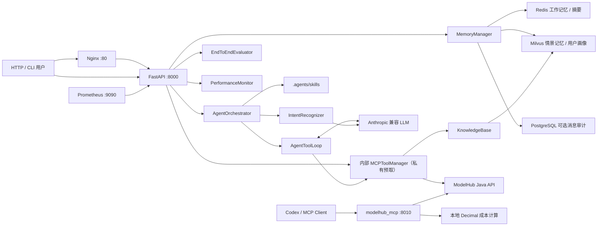
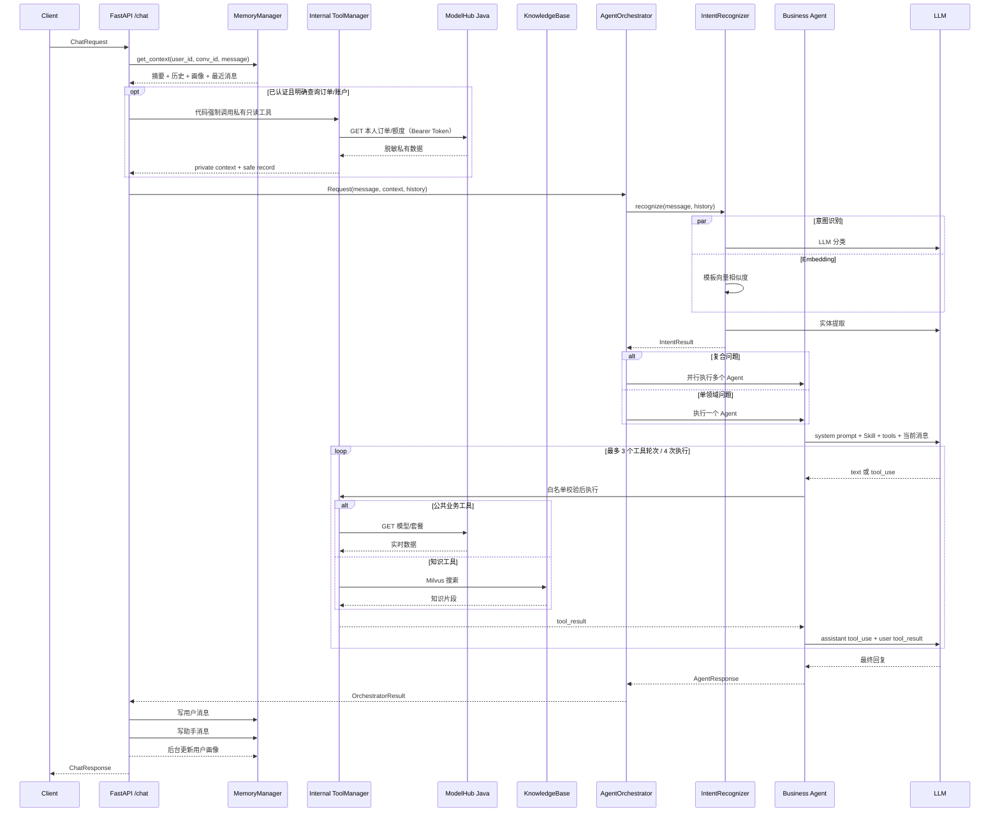

# ModelHub Token Agent 模块与执行流程详解

> 文档依据当前仓库代码整理，核对日期：2026-08-21。为避免源码调整后失效，本文只引用文件和符号名，不固定源码行号。

## 1. 项目定位

该项目是一个面向 ModelHub 大模型服务商城的智能助手，主要能力包括：

- 模型发现、比较与选型；
- Token 用量和成本估算；
- Token 套餐、订单、额度和库存说明；
- API、SDK、鉴权和限流排障；
- 异常调用、密钥盗用和账号争议的风险复核；
- Redis + Milvus + 可选 PostgreSQL 的多层对话记忆；
- Milvus 知识库 RAG；
- 多 Agent 路由、并行协作、项目级 Skills；
- 标准 MCP 2.0 公共只读服务；
- 端到端评测、运行监控、Prometheus 和 Docker 部署。

项目有两条容易混淆但彼此独立的工具链：

1. `modelhub_tools.MCPToolManager` 是主应用内部的工具注册和执行框架，负责缓存、超时、熔断、fallback、查询改写和重排。它不是标准 MCP 协议服务器。
2. `modelhub_mcp` 是基于官方 Python MCP SDK 的标准 MCP 服务，面向 Codex 或其他 MCP Client，提供 7 个公共只读工具。

## 2. 总体架构



主进程依赖关系可以概括为：

```text
FastAPI
├─ AgentOrchestrator
│  ├─ IntentRecognizer
│  ├─ ProjectSkillRegistry
│  ├─ AgentToolLoop
│  └─ 6 类实际 Agent（另有 MANUAL_REVIEW 占位类型）
├─ MemoryManager
│  ├─ Redis
│  ├─ MilvusTextStore × 2
│  └─ PostgresMessageStore（可选）
├─ MCPToolManager（内部工具框架）
│  ├─ knowledge_search → KnowledgeBase → Milvus
│  └─ 9 个 ModelHub 内部业务工具
│     ├─ 6 个公共 Java 查询
│     ├─ 1 个按 model_id 实时取价的成本计算
│     └─ 2 个代码专用的私有 Java 查询
├─ PerformanceMonitor
└─ EndToEndEvaluator

独立 MCP 进程
└─ MCPServer
   ├─ 6 个 Java 公共查询工具
   └─ 1 个本地确定性成本工具
```

## 3. 目录与模块职责

| 目录或文件 | 核心职责 | 主要入口 |
|---|---|---|
| `api/main.py` | FastAPI 装配、生命周期、HTTP 路由、CLI | `lifespan()`、`chat()`、`_cli()` |
| `agents/agent_orchestrator.py` | Agent 定义、意图路由、并行协作、Skill 注入、审核标记 | `AgentOrchestrator.run()` |
| `agents/tool_use.py` | 受 ToolPolicy 约束的模型工具选择、执行、回传和审计循环 | `AgentToolLoop.run()` |
| `core/intent_recognizer.py` | LLM、Embedding、关键词三路意图识别和实体提取 | `IntentRecognizer.recognize()` |
| `core/project_skills.py` | 加载、校验和渲染仓库级 Skill | `ProjectSkillRegistry.resolve()` |
| `memory/conversation_memory.py` | 工作记忆、情景记忆、会话摘要、用户画像 | `MemoryManager.get_context()`、`add_message()` |
| `modelhub_tools/tool_manager.py` | 内部工具注册、缓存、熔断、超时、fallback、改写、重排 | `MCPToolManager.call()` |
| `modelhub_tools/knowledge_base.py` | 知识切片、种子导入、Milvus 检索 | `KnowledgeBase` |
| `modelhub_tools/model_hub_client.py` | 调用 ModelHub Java 只读接口并统一响应/单位 | `ModelHubClient` |
| `storage/vector_store.py` | Embedding 和 Milvus collection 封装 | `TextEmbedder`、`MilvusTextStore` |
| `storage/postgres_store.py` | 可选的原始聊天消息持久化 | `PostgresMessageStore` |
| `modelhub_mcp/` | 标准 MCP 2.0 服务 | `python -m modelhub_mcp` |
| `.agents/skills/` | Codex 可发现、主应用也可加载的项目 Skills | 各 `SKILL.md` |
| `evaluation/evaluator.py` | 意图诊断、对话质量、硬规则、LLM Judge、回归基线 | `EndToEndEvaluator.run()` |
| `monitor/performance_monitor.py` | Agent/工具统计、告警、路由惩罚、Prometheus | `PerformanceMonitor` |
| `tools/` | Milvus 重建、知识重置、MCP 冒烟测试 | 各脚本 `main()` |
| `tests/` | 单元、协议和安全回归测试 | `unittest` |
| `Dockerfile`、`docker-compose.yml` | 主应用、MCP、Nginx、Prometheus 部署 | Docker Compose |

## 4. 主应用启动与关闭流程

### 4.1 模块导入阶段

`api/main.py` 被 Uvicorn 导入时会先执行：

1. 计算仓库根目录并加入 `sys.path`，保证从任意工作目录都能导入项目模块。
2. 调用 `load_dotenv()` 加载环境变量。
3. 初始化全局日志。
4. 创建 FastAPI 对象并绑定 `lifespan()`。
5. 注册全开放 CORS：来源、方法、请求头均为 `*`。

此时还没有创建 Agent、Redis、Milvus 或工具客户端。

### 4.2 FastAPI lifespan 启动顺序

生命周期入口是 `api/main.py` 的 `lifespan()`：

1. 打印启动 Banner。
2. 延迟导入 Agent、意图识别、评测、工具、知识库、记忆和监控模块。
3. `_anthropic_cfg()` 检查 `ANTHROPIC_API_KEY`，读取模型和可选兼容地址。
4. `_storage_cfg()` 读取 Milvus、Embedding、PostgreSQL 配置。
5. `_model_hub_cfg()` 读取 Java 后端地址、超时和开关。
6. 创建一个独立 `IntentRecognizer`，专供评测模块使用。
7. 创建 `AgentOrchestrator`：
   - 再创建一个用于在线请求的 `IntentRecognizer`；
   - 严格加载 `.agents/skills`；
   - 创建实际业务 Agent 池。
8. 创建 `MemoryManager`：
   - 构造 Redis 客户端；
   - 立即连接并加载情景记忆 Milvus collection；
   - 立即连接并加载用户画像 Milvus collection；
   - 如果配置了 `DATABASE_URL`，初始化 PostgreSQL 表。
9. 创建内部 `MCPToolManager`。
10. 创建 `KnowledgeBase`，立即连接第三个 Milvus collection；collection 为空时自动导入种子知识。
11. 注册 `knowledge_search`，设置 300 秒缓存、重排和结构化 fallback。
12. 若 `MODELHUB_TOOLS_ENABLED=true`：
    - 创建 `ModelHubClient`；
    - 注册 6 个公共 Java 查询、1 个按模型实时取价的成本计算和 2 个私有 Java 查询工具；
    - 为 6 个旧内部名称注册不向模型展示的兼容别名。
13. 把同一个 `MCPToolManager` 绑定到全部 Agent，记录运行时实际可用工具集合。
14. 创建 `PerformanceMonitor` 并启动后台采集任务。
15. 创建 `EndToEndEvaluator`，注入复用真实 `/chat` 链路的 `eval_chat_runner`。
16. 输出“EchoMind 已就绪”，执行 `yield`，开始处理请求。

全局组件保存在 `api/main.py` 的模块变量中：`_orchestrator`、`_memory`、`_tool_manager`、`_monitor`、`_evaluator` 和 `_model_hub_client`。

### 4.3 启动依赖和失败边界

| 依赖或配置 | 初始化行为 | 失败结果 |
|---|---|---|
| Anthropic API Key | 启动时只检查是否为空 | 为空则启动失败；错误 Key 通常到首次请求才暴露 |
| Skills | 启动时严格扫描和校验 | 缺失、为空或格式非法会启动失败 |
| Milvus | 构造 `MilvusTextStore` 时立即连接、建表/验维和 load | 不可用或维度不符会启动失败 |
| Redis | `redis.from_url()` 惰性连接 | 通常启动成功，首次聊天读写时失败 |
| PostgreSQL | 初始化时尝试连接和建表 | 失败后禁用消息落库，主服务继续 |
| Java 后端 | 只创建客户端，不立即请求 | 离线不阻止启动，具体工具调用时降级 |
| Embedding | 初始化本地哈希或 sentence-transformers | 编排器意图 Embedding 可降级；记忆/知识库配置错误可能阻止启动 |
| Prometheus 独立端口 | 仅 `PROMETHEUS_PORT` 非零时监听 | 端口冲突会阻止启动 |

`.env.example` 中的 `APP_NAME`、`ANOMALY_DETECTION_THRESHOLD`、`ENABLE_SWAGGER_UI`、`ENABLE_MONITORING`、`ENABLE_EVALUATION` 当前没有被主代码读取；Swagger、Monitor 和 Evaluator 实际上始终启用，异常检测敏感度仍使用代码默认值。

### 4.4 关键环境变量

| 配置 | 作用 | 默认或说明 |
|---|---|---|
| `ANTHROPIC_API_KEY` | LLM 鉴权 | 必填 |
| `ANTHROPIC_BASE_URL` | Anthropic 兼容服务地址 | 可选 |
| `ANTHROPIC_MODEL` | 意图、Agent、摘要、画像、Judge 使用的模型 | `claude-3-5-sonnet-20241022` |
| `REDIS_URL` | 工作记忆和会话摘要 | API 默认 `redis://redis:6379/0` |
| `MILVUS_URI`、`MILVUS_TOKEN` | 三类向量 collection 连接 | Milvus 是启动强依赖 |
| `MILVUS_*_COLLECTION` | 知识、情景、画像 collection 名 | 三个独立 collection |
| `EMBEDDING_BACKEND` | `stable` 或 `sentence_transformers` | API 默认 `stable` |
| `EMBEDDING_MODEL`、`EMBEDDING_DEVICE` | 本地 Embedding 模型和设备 | sentence-transformers 模式必需模型名 |
| `EMBEDDING_DIM`、`MILVUS_DIM` | 向量维度 | `EMBEDDING_DIM` 优先，默认 256 |
| `EMBEDDING_QUERY_INSTRUCTION` | 查询向量前缀指令 | 可选 |
| `DATABASE_URL` | PostgreSQL 原始消息落库 | 不配置则禁用 |
| `MODELHUB_TOOLS_ENABLED` | 主应用是否注册 Java 工具 | 默认 true |
| `MODELHUB_API_BASE_URL`、`MODELHUB_API_TIMEOUT` | Java 后端地址和超时 | 默认 `127.0.0.1:8081`、5 秒 |
| `AGENT_TOOL_USE_ENABLED` | 主应用是否启用模型工具循环 | 默认 true |
| `AGENT_TOOL_MAX_ROUNDS/CALLS/PARALLEL_CALLS` | 工具轮次、总次数和并发上限 | 默认 3 / 4 / 3 |
| `AGENT_TOOL_RESULT_MAX_CHARS` | 单个 tool_result 最大字符数 | 默认 8000 |
| `ALLOW_LEGACY_BODY_AUTH_TOKEN` | 是否临时兼容请求体 Token | 默认 false，生产不建议开启 |
| `MODELHUB_DEBUG_PRIVATE_TOOLS` | 调试接口是否允许私有查询 | 默认 false |
| `PROJECT_SKILLS_DIR` | 项目 Skill 路径 | `.agents/skills`，相对仓库根目录 |
| `MONITOR_INTERVAL`、`ALERT_WEBHOOK_URL` | 采集周期和可选告警 Webhook | 默认 10 秒 |
| `PROMETHEUS_PORT` | 是否另开 Prometheus HTTP 端口 | 0 表示不另开，也不创建自定义指标对象 |
| `EVAL_BASELINE_PATH` | 评测基线文件 | `data/eval/baseline.json`；只在请求显式更新时覆盖 |
| `EVAL_ADMIN_TOKEN` | `/eval/run` 管理员 Bearer 密钥 | 默认空；为空时评测接口返回 503 |
| `API_HOST`、`API_PORT`、`APP_ENV` | 直接运行 `api/main.py` 时的监听和 reload | Docker 默认命令不会读取监听值 |
| `MODELHUB_MCP_TRANSPORT/HOST/PORT` | 标准 MCP 默认传输与监听 | stdio、127.0.0.1、8010 |

### 4.5 关闭流程

FastAPI 退出时当前只执行：

```text
await _monitor.stop()
```

Monitor 会取消采集任务并吸收 `CancelledError`。当前没有显式关闭 Redis、Milvus、Anthropic 或其他客户端，也没有用 `try/finally` 包住 lifespan 的 `yield`。

## 5. `/chat` 完整执行流程

### 5.1 时序图



### 5.2 请求模型

`ChatRequest` 包含：

- `message`：用户消息；
- `user_id`：默认 `anonymous`；
- `conv_id`：可选，不提供则生成 UUID；
- `auth_token`：已弃用且默认忽略；私有查询使用 HTTP `Authorization: Bearer <token>`；
- `model_id`、`package_id`、`order_id`：显式业务实体；
- `model_keyword`、`category`、`current`：模型搜索和分页参数。

### 5.3 顺序执行步骤

`api/main.py` 的 `_chat_impl()` 按以下顺序运行，公开 `chat()` 只负责传入 HTTP 鉴权和正常持久化开关：

1. 检查 `_orchestrator` 和 `_memory`，未就绪返回 503。
2. 复用请求 `conv_id`，或生成新的 UUID。
3. `MemoryManager.get_context()` 串行读取：
   - Redis 最近工作记忆；
   - Milvus 跨会话情景记忆；
   - Milvus 用户画像；
   - Redis 会话摘要。
4. 取最近 5 条消息，转换为意图识别使用的结构化 `history`。
5. `_build_private_model_hub_context()` 只对明确私有动作做确定性预取：订单必须同时有 `order_id` 和订单查询短语，账户必须出现“我的余额/额度/用量”等明确短语；私有工具禁用缓存。
6. 拼接记忆和脱敏私有数据为 `Request.context`；公开模型/套餐与知识库不再在编排前预取。
7. 创建编排请求，同时传入显式业务参数、可信主体摘要和私有工具安全记录。
8. `AgentOrchestrator.run()` 完成意图识别、实体传递、路由、Skill 注入与 `ToolPolicy` 生成。
9. Agent 在白名单内执行标准 `tool_use → tool_result` 循环；达到预算后以一次无工具调用收尾。
10. Agent 完成后，先写用户消息，再写助手消息。
11. `asyncio.create_task()` 后台更新用户画像，不等待完成。
12. 从权威工具记录派生 `tools_used`、`knowledge_used` 和 `business_data_used` 并返回。

`ChatResponse` 返回：文本回复、意图、主/协作 Agent、使用的 Skills、`tools_used`、`authoritative_tools_used`、工具次数/轮次/限额标记、审核标记、编排耗时、知识库和业务数据使用标记。fallback、失败和被拒工具不会通过权威数据门禁。

`latency_ms` 只统计 `AgentOrchestrator.run()` 内部耗时，因此包含意图识别、Agent LLM、主循环中的公共 Java 工具、知识查询改写/召回/重排以及多 Agent 汇总；它不包含前置记忆读取、代码确定性私有预取、后置记忆写入、画像更新和 FastAPI 序列化，所以仍不是完整 HTTP 延迟。

### 5.4 主链路上下文优先级

Agent system prompt 明确要求：

1. 实时模型、价格、库存、订单和额度以成功且权威的 Java 工具结果为准；
2. 平台规则和解释可由 Agent 通过 `knowledge_search` 获取；
3. 抢购、支付、退款、额度调整和 API Key 操作只能引导用户回业务页面确认；
4. 项目 Skill 作为可信 system 指令注入，优先级高于普通背景文本。

## 6. ModelHub 实时业务数据链路

### 6.1 策略生成

意图识别完成后，编排器将“Agent 能力范围 ∩ 已注册工具 ∩ 本次请求约束”生成 `ToolPolicy`。自然语言实体现在保存在 `Request.entities`，模型名实体可作为搜索默认值；API 显式提交的 ID/关键词优先，并覆盖模型生成的同名参数。

### 6.2 工具选择逻辑

公开数据由模型在代码白名单内选择，明确实体会触发首轮强制查询：

| 条件 | 内部工具 |
|---|---|
| 模型选型且有 `model_id` | 强制 `modelhub_get_model` |
| 模型选型且有关键词/模型实体 | 强制 `modelhub_search_models` |
| 无候选的模型选型 | 强制 `modelhub_hot_models` |
| 套餐问题且有 `package_id` | 强制 `modelhub_get_package` |
| 有 `model_id` 的套餐问题 | 强制 `modelhub_list_packages` |
| 成本问题且有 `model_id` | 首轮强制 `modelhub_get_model`；随后可调用 `modelhub_estimate_cost` |
| 成本问题且无 `model_id` | 先从热门/搜索结果确定模型，再调用成本工具；不能凭空填写价格 |
| API/风控规则 | 强制或允许 `knowledge_search` |
| 已认证且明确订单/账户问题 | 代码预取 `token_order` / `token_account`，模型不可选择 |

首轮 `tool_choice` 可以是 `auto`、`any` 或具体工具；后续一律恢复 `auto`。私有订单/账户与任何交易、密钥、风控处置工具永不进入模型白名单。

### 6.3 Java API 映射

| 内部工具 | Java GET 端点 | 缓存 TTL |
|---|---|---:|
| `modelhub_hot_models` | `/ai-model/hot` | 60 秒 |
| `modelhub_search_models` | `/ai-model/search` | 60 秒 |
| `modelhub_get_model` | `/ai-model/{model_id}` | 120 秒 |
| `modelhub_list_packages` | `/token-package/model/{model_id}` | 60 秒 |
| `modelhub_get_package` | `/token-package/{package_id}` | 30 秒 |
| `modelhub_hot_packages` | `/token-package/hot` | 30 秒 |
| `modelhub_estimate_cost` | 先访问 `/ai-model/{model_id}` 取得原始分价，再用 Decimal 计算 | 不缓存 |
| `token_order` | `/token-order/{order_id}` | 不缓存 |
| `token_account` | `/token-order/account/me` | 不缓存 |

`ModelHubClient` 每次调用都会创建一个新的 `httpx.AsyncClient`，使用 `trust_env=False`，执行 GET 和 `raise_for_status()`，再统一转换为 `{success, data, total}`。

内部与标准 MCP 虽然都使用 `modelhub_estimate_cost` 这个规范名称，但参数来源不同：

- 主应用内部工具接收 `model_id`、输入/输出 Token 和请求次数；handler 自己查询 Java 模型详情，从 `inputPrice/outputPrice` 取得实时原始分价，再调用同一个 Decimal 纯函数，结果标记 `price_source=modelhub_model_detail`。
- 独立标准 MCP 工具不接收 `model_id`、不访问 Java；调用方必须显式传入输入/输出分价。MCP Client 应先用公共查询工具取得价格，不能把未经核验的价格当成实时平台报价。

客户端递归保留 Java 原始“分”字段，并添加明确的人民币元字段：

- `inputPrice` → `inputPriceYuanPerMillionToken`；
- `outputPrice` → `outputPriceYuanPerMillionToken`；
- `payValue` → `payValueYuan`；
- `tokenQuota` 额外标记单位为 Token。

### 6.4 required 与 optional 失败

Java 超时、HTTP 异常、解析错误会被内部工具框架捕获。公开查询可返回 `fallback_used=true`、`authoritative=false` 的结构化降级结果，私有查询和内部成本工具没有 fallback。

- 首轮 `tool_choice` 是具体工具或 `any` 时，属于 required evidence。工具不存在、模型未按要求调用、结果失败/fallback 或同轮没有任何权威成功记录都会失败关闭；编排器返回“当前无法核验”的安全文案，不会用无约束 General 回答替代实时证据。
- 首轮为 `auto` 时属于 optional。工具错误会作为 `tool_result` 回传，让模型明确说明未核验；只有网关以 400/404/422 明确表示不支持 tools 能力时，才直接降为无工具回答，401、429、超时和普通 5xx 不会被误判为“不支持工具”。
- 工具已成功执行、但后续 LLM 调用失败时，`ToolLoopError` 仍携带已经产生的工具记录、轮次和限额状态，避免审计信息丢失。
- fallback、失败、拒绝、无效、重复和超预算记录都不能满足 `authoritative_tools_used` 或评测中的 critical required tool 门禁。

公共工具默认只按参数共享缓存；只有工具显式声明 `cache_context_keys` 时，选定的上下文字段才以 SHA-256 摘要进入缓存键。私有工具始终 `use_cache=False`，因此认证 Token 不会进入共享缓存。

## 7. RAG 与知识库执行流程

### 7.1 何时检索

知识库现在是 Agent 可见的只读工具。模型选型、成本、套餐、API 支持、风控和人工复核 Agent 均可调用；API 支持、风控和人工复核通常在首轮强制调用。寒暄、反馈和普通 OTHER 请求没有业务工具。

### 7.2 检索增强流程

主 Agent 循环和独立 `POST /search` 都通过 `search_with_rewrite()` 执行完整增强链；Agent 默认取 3 条且把 `top_k` 限制在 10 以内：

```text
原始问题
→ LLM 改写为多个不同角度的子查询，同时保留原问题
→ 对所有子查询并行调用 knowledge_search
→ 按标题、片号和内容 MD5 去重
→ LLM 按原问题重排
→ 返回 Top-K
```

- 查询改写失败：退回原始查询。
- 部分召回失败：保留其他成功结果。
- 全部无结果：返回失败。
- 重排失败：保留原始召回顺序。
- Agent 工具结果以结构化 `tool_result` 回传，并受单结果 8000 字符上限控制。

### 7.3 KnowledgeBase

`KnowledgeBase` 的运行过程：

1. 构造 `MilvusTextStore`，连接指定 collection。
2. collection 为空时读取 `data/knowledge/modelhub_seed.json`。
3. 当前种子包含 8 类文档：业务边界、模型选型、成本口径、套餐抢购、订单到账、API 错误码、API Key 安全、额度风控。
4. 每篇文档按句号/换行切成约 500 字片段。
5. `title + chunk index + 片段前缀` 生成稳定 MD5 ID。
6. 写入 Milvus，并保存分类、标签和片号。
7. 检索时做向量召回，再映射为 `title/content/score/category/tags/chunk`。

若种子文件不存在或格式错误，会导入一条最小“ModelHub 默认安全边界”文档。

`search_handler()` 使用 `asyncio.to_thread()` 承接同步 Milvus 搜索，避免阻塞 FastAPI 事件循环。知识库 fallback 会标记 `fallback_used=true`、`authoritative=false`，不会再把降级说明计为 `knowledge_used=true`。

## 8. 内部 MCPToolManager 流程

### 8.1 Tool 数据结构

每个内部 `Tool` 包含：

- 名称、描述和 handler；
- 简化 JSON Schema；
- 缓存 TTL；
- 执行超时；
- 是否支持重排；
- 同步或异步 fallback；
- 运行时统计和独立熔断器。

### 8.2 一次调用

```text
解析兼容别名并检查工具是否存在
→ 校验 required、未知字段、基础类型和数值/长度边界
→ 根据 params + 已声明的 context 范围查 TTL 缓存
→ 检查熔断器
→ asyncio.wait_for 执行 handler
→ 识别业务 success=false
→ 更新成功/失败/延迟统计与熔断状态
→ 只把成功结果写缓存
→ 可选 LLM 重排
→ ToolResult
```

返回的 `ToolResult` 包含 `success`、`data`、`error`、`cached`、`latency_ms`、`reranked`、`fallback_used` 和 `authoritative`。handler 返回业务 `success=false` 会计为失败、推动熔断且不写缓存；参数错误在缓存和熔断之前返回，不会污染全局熔断状态。

### 8.3 熔断器

状态机为：

```text
CLOSED
  └─ 连续失败 5 次 → OPEN
OPEN
  └─ 等待 60 秒 → HALF_OPEN，放行一次探测
HALF_OPEN
  ├─ 成功 → CLOSED
  └─ 失败 → OPEN
```

HALF_OPEN 使用 `probe_in_flight` 保证同一时刻只放行一个恢复探测。调用方取消请求时只释放探测占用：不增加失败计数；若取消的是半开探测，则安全回到 OPEN 并重新计恢复窗口。

### 8.4 缓存和 fallback

- 缓存只存在当前 Python 进程中，重启即失效，多 worker 不共享。
- 最多 5000 项，达到上限时按字典顺序删除前 1/4。
- `use_cache=False` 会同时禁止读缓存和写缓存。
- 公共工具默认按参数共享；需要租户隔离的工具必须显式声明上下文键，而私有工具当前完全禁用缓存。
- 同步/异步 fallback 都受支持。
- fallback 成功时 `ToolResult.success=True`，但 `error` 保留原故障原因，且强制标记为非权威。

## 9. 意图识别流程

### 9.1 支持意图

`IntentCategory` 包括：通用查询、投诉、请求、问候、人工复核、反馈、模型搜索、成本估算、Token 套餐、API 支持、用量分析、风险和其他。

### 9.2 冷请求识别流程

```text
消息清洗
→ 查内存缓存
→ 并行：LLM 意图分类 + Embedding 模板相似度
→ 同步关键词匹配
→ 三路加权投票
→ 再调用一次 LLM 提取实体
→ 判断紧急程度
→ 写入最多 1000 条的内存缓存
→ IntentResult
```

在不使用 RAG 的冷请求中，正式回答之前通常已经发生两次意图模块 LLM 请求：一次分类、一次实体提取；随后业务 Agent 再调用一次 LLM。

### 9.3 三路策略

| 策略 | 正常权重 | 说明 |
|---|---:|---|
| LLM | 70% | Few-shot + 最近 3 条结构化历史 |
| Embedding | 20% | 用户消息与意图模板做余弦相似度 |
| 关键词 | 10% | 本地零延迟兜底，业务类别有额外加权 |

Embedding 不可用时改为 LLM 85% + 关键词 15%。LLM 完全失败时依次尝试 Embedding、关键词，最后返回 `OTHER`。

最终融合得分低于 0.5 时返回 `OTHER`。当前 `IntentResult.confidence` 保存的是原始 LLM 置信度，而不是融合后的最终得分。

### 9.4 紧急程度

- `CRITICAL`：紧急、urgent、asap、立刻，或人工复核意图；
- `HIGH`：今天、马上、尽快，或投诉意图；
- `MEDIUM`：这周、soon、快点；
- `LOW`：其他请求。

### 9.5 缓存边界

意图缓存键只使用清洗后消息的前 200 字符，不包含用户、会话、历史或后续文本。因此相同开头但不同上下文的消息可能复用同一意图和实体结果。

`learn()` 可以把纠正样本加入内存模板并清除对应向量缓存，但不会持久化，进程重启后丢失。

## 10. Agent 编排、路由与审核

### 10.1 Agent 类型

| AgentType | 职责 |
|---|---|
| `GENERAL` | 通用 ModelHub 助手 |
| `MODEL_ADVISOR` | 模型发现、比较和选型 |
| `COST_OPTIMIZER` | Token 成本估算和优化 |
| `QUOTA_ORDER` | 套餐、订单、额度、库存和有效期 |
| `API_SUPPORT` | API、SDK、鉴权、限流和错误码 |
| `QUOTA_RISK` | 刷购、Key 共享、盗用、异常调用和申诉 |
| `MANUAL_REVIEW` | 人工复核占位类型，没有实际 Agent 实例 |

当前每种实际 Agent 默认只有一个实例，但数据结构支持同类多实例。

### 10.2 静态意图路由

| 意图 | 默认 Agent |
|---|---|
| `model_search` | `MODEL_ADVISOR` |
| `cost_estimation`、`usage_analysis` | `COST_OPTIMIZER` |
| `token_package` | `QUOTA_ORDER` |
| `api_support` | `API_SUPPORT` |
| `risk`、`complaint` | `QUOTA_RISK` |
| `feedback` | `GENERAL` |
| `manual_review` | `MANUAL_REVIEW` |
| 其他 | `GENERAL` |

`CRITICAL` 紧急度优先覆盖普通路由，目标变为 `MANUAL_REVIEW`。因为当前没有对应实例，执行时会降级到 `GeneralAgent`，但仍注入风险复核 Skill，并把 `review_required` 设为真。

### 10.3 性能路由

同类存在多个实例时，`_best_agent()` 选择 `routing_score()` 最高者：

```text
延迟分 = 1 / (1 + 平均毫秒 / 1000)
基础分 = 成功率 × 0.7 + 延迟分 × 0.3
最终分 = 基础分 × (1 - Monitor 惩罚)
```

Monitor 可回写 `0.0～0.9` 的惩罚值。默认池每类只有一个实例时，惩罚主要影响统计展示；增加同类实例后才会产生真正的择优路由效果。

### 10.4 复合问题与并行协作

`_collaboration_targets()` 扫描模型、成本、套餐、API、风险五组关键词。命中多个领域时：

1. 主意图对应的 Agent 作为 primary；
2. 其他 Agent 作为协作者；
3. `asyncio.gather(return_exceptions=True)` 并行执行；
4. 只拼接成功响应，格式为 `[agent_type]\n内容`；
5. Skill 名按首次出现顺序去重；
6. 任意成功响应要求审核，或请求为 CRITICAL/MANUAL_REVIEW，则整体审核；
7. 全部失败时返回统一失败文案。

并行结果的 `agent_type` 始终是预先选定的 primary。即使 primary 失败而协作者成功，元数据仍可能报告原 primary。

### 10.5 Agent LLM 调用

每个 Agent 的实际消息结构为：

```text
system:
  Agent 固有 system prompt
  + 项目内部 Skill 工作流

user:
  [背景信息]
  记忆 + 已认证私有预取数据（如有）

assistant:
  好的，我已了解背景信息。

user:
  当前用户问题

assistant:
  text 和/或 tool_use

user:
  与每个 tool_use_id 对应的 tool_result
```

回答 Agent 没有直接接收结构化多轮 history；历史已被记忆模块展平为背景文本。结构化 history 只用于意图识别。

工具可用时，`AgentToolLoop` 向 Anthropic 请求同时传入代码生成的工具 schema 和首轮 `tool_choice`。每个 `tool_use` 依次经过白名单、参数对象、defaults/locked inputs 合并、Schema、重复签名和剩余预算检查；同轮通过检查的调用在 Semaphore 内并行执行，但 `tool_result` 严格保持原 block 顺序。循环状态、重复签名和预算均为方法局部变量，同一 Agent 的并发请求不会串线。默认边界是 3 轮、4 次实际执行、单轮最多 3 个并发调用、单结果最多 8000 字符；达到上限后以无 `tools` 请求生成最终回答。

### 10.6 Agent 失败降级

- 普通 LLM 异常由 `BaseAgent.handle()` 捕获，返回 `success=false` 和统一文案。
- `ToolLoopError` 除错误外还保留已执行工具、权威工具、轮次和限额状态；响应失败也不会抹掉审计轨迹。
- required evidence 失败时不降级为 General 自由回答。编排器改写为不能核验的安全回复，并按风险类型决定是否要求人工复核。
- optional 路径的专属 Agent 失败时可调用 `GeneralAgent`；它沿用原 Skill，但关闭工具并注入“实时/知识工具不可用”的降级状态，禁止声称已核验。
- 并行执行中，零预算协作者用 `skip_execution` 安全跳过；其他单 Agent 异常会被收集，不影响仍成功的响应。
- Skill 解析错误不在 Agent 的异常保护内；串行请求会向上抛出，并行时会成为被跳过的异常结果。

### 10.7 人工审核

审核信号来自三处：

1. Agent 回复含“平台侧确认、人工审核、人工复核、无法确认、无法处理”等关键词；
2. 紧急度为 `CRITICAL`；
3. 意图为 `MANUAL_REVIEW`。

当前实现只记录日志并返回 `review_required=true`，没有创建真实工单、数据库审核记录或消息队列任务。

## 11. 项目 Skills 执行流程

### 11.1 两种使用方式

同一套 `.agents/skills` 同时服务两类消费者：

```text
Codex 客户端
→ 自动发现 SKILL.md
→ 按 Skill 工作流调用标准 modelhub MCP 工具

主 FastAPI 应用
→ ProjectSkillRegistry 加载 SKILL.md
→ AgentOrchestrator 按意图/Agent 映射
→ 将正文追加到 system prompt
→ 代码生成只读工具白名单和强制规则
→ Agent 通过进程内 MCPToolManager 执行 tool-use 循环
```

两条链现在都能真实使用工具，但执行面不同：Codex 通过标准 MCP 协议连接独立服务；主应用复用进程内 `MCPToolManager`，避免 HTTP 回调自己。二者共享规范工具名和业务口径，但不共享会话或认证状态。

### 11.2 加载与校验

`ProjectSkillRegistry` 扫描 `.agents/skills/*/SKILL.md`，并检查：

- UTF-8；
- YAML frontmatter 只能有 `name` 和 `description`；
- name 必须是小写连字符格式；
- 目录名与 name 相同；
- 名称不重复；
- 指令非空；
- 单个 Skill 默认不超过 6000 字；
- 单次渲染总长度默认不超过 18000 字。

解析后的正文会渲染成：

```xml
<project-skill name="modelhub-cost-estimation">
...
</project-skill>
```

并行 Agent 使用 `dataclasses.replace()` 获得独立 Request 副本，避免不同 Skill 互相串写。

### 11.3 当前 Skills

| Skill | 使用场景 | MCP 依赖 |
|---|---|---|
| `modelhub-model-selection` | 模型发现、比较、上下文/质量/价格权衡 | `modelhub` |
| `modelhub-cost-estimation` | 用量、预算、成本和优化 | `modelhub` |
| `modelhub-quota-order` | 套餐、库存、订单、额度和有效期 | `modelhub` |
| `modelhub-api-troubleshooting` | 401/403/404/429/5xx、SDK 和网络排障 | `modelhub` |
| `modelhub-risk-review` | 异常调用、密钥盗用、账号争议和人工复核 | 无，纯规则 Skill |

四个业务 Skill 的 `agents/openai.yaml` 声明 Streamable HTTP MCP 地址 `http://127.0.0.1:8010/mcp`。仓库当前没有 `.codex/config.toml`，因此 Skill 元数据描述了依赖，但 Codex 客户端仍需要实际配置并启动该 MCP 服务。

## 12. 三级记忆与持久化

### 12.1 层级

| 层级 | 存储 | 作用 | 读取方式 |
|---|---|---|---|
| 工作记忆 | Redis list | 当前会话最近消息 | 按时间恢复，最多读取 20 条 |
| 会话摘要 | Redis string | 压缩后的当前会话摘要 | 直接读取，24 小时 TTL |
| 情景记忆 | Milvus | 跨会话相关历史 | 向量检索，最多 5 条 |
| 用户画像 | Milvus | 偏好和关键实体 | 取该用户最新画像 |
| 原始消息 | PostgreSQL，可选 | 审计和持久化 | 当前不参与上下文回放 |

`MemoryContext.to_prompt_text()` 的展开顺序是：会话摘要 → 相关历史（最多 3 条）→ 用户画像 → 最近对话。

### 12.2 读取

`get_context()` 串行执行：

1. Redis `LRANGE` 获取工作记忆；
2. Milvus 按 `user_id + kind=episodic` 检索相关历史；
3. Milvus 按 `user_id + kind=profile` 查询最新画像；
4. Redis 获取会话摘要。

情景检索和画像查询失败会降级为空；Redis 连接、Redis JSON 反序列化错误没有同级保护，会使 `/chat` 失败。

### 12.3 写入和压缩

`add_message()`：

1. 清洗用户、会话、内容和 metadata；
2. Redis `LPUSH`，最新消息在前；
3. 设置 24 小时 TTL；
4. 可选写 PostgreSQL；
5. 列表达到 15 条时立即压缩。

压缩流程：

```text
读取完整 Redis 原始快照（latest-first）
→ 保留最近 5 条
→ LLM 总结其余消息
→ WATCH 工作记忆和摘要 key
→ 校验当前列表仍以原快照为后缀
→ MULTI/EXEC 原子 LTRIM（保留并发 LPUSH 前缀 + 快照最近 5 条）并追加摘要
→ 事务成功后把摘要写入 Milvus 情景记忆
```

摘要 LLM 失败时使用“对话包含 N 条消息（摘要生成失败）”占位。情景记忆写入失败只记录日志，仍会继续重置工作记忆。

压缩使用 Redis 乐观事务；WATCH 冲突最多重试 5 次，快照后缀不匹配时安全放弃本轮，绝不覆盖新消息。Redis key 的 user/conv 段分别进行百分号编码，避免 `:` 分隔符造成组合碰撞；已认证 HTTP 请求的记忆主体使用 Token 的 SHA-256 摘要，不把原 Token 写入 key。

### 12.4 用户画像

每次聊天结束都会后台执行：

1. 读取当前工作记忆；
2. 拼接最近 10 条；
3. LLM 提取 preferences 和 entities JSON；
4. 写入 Milvus 画像 collection。

画像更新不计入 HTTP 返回延迟。LLM/JSON/Milvus 异常大多只记 warning；但 Redis 读取发生在方法内部 try 之前，失败时后台任务可能产生未消费异常。

### 12.5 PostgreSQL

配置 `DATABASE_URL` 后会创建：

- `conversations(conv_id PRIMARY KEY, user_id, created_at, updated_at)`；
- `messages(id UUID PRIMARY KEY, user_id, conv_id, role, content, metadata, created_at)`；
- 用户/会话/时间索引。

每次消息写入在线程中同步执行 upsert conversation + insert message。运行期写失败只记录 warning，不阻止 Redis 主记忆。

`conv_id` 单独作为 conversations 主键；若不同用户可以提交相同 conv_id，upsert 会更新其 user_id。当前需要由上层身份和会话归属校验保证隔离。

## 13. 向量存储与 Embedding

### 13.1 TextEmbedder

支持两类后端：

1. `stable/hash/local`：字符 1～3 gram + MD5 哈希生成固定维度归一化向量；无需模型和网络，但语义能力较弱。
2. `sentence_transformers/bge`：加载指定模型，可增加查询 instruction，输出归一化向量。

sentence-transformers 模型按 `(model_name, device)` 做进程级缓存。模型实际维度与配置维度不一致时直接报错，要求调整维度并重建 collection。

### 13.2 MilvusTextStore

初始化时会：连接 Milvus → 检查/创建 collection → 创建 COSINE AUTOINDEX → load collection。

固定 schema 包含：

```text
id, vector, text, title, user_id, conv_id, kind,
metadata, ts, chunk_index, total_chunks
```

写入时：清洗和截断字段 → 生成向量 → 尝试删除相同 ID → insert → flush。删除异常会被忽略；若旧主键实际仍存在，后续 insert 可能失败。

检索时：生成 query 向量 → COSINE 搜索 → 可选 Milvus expr 过滤 → 解析 metadata JSON → 返回统一字典。

`clear()` 会直接 drop collection 并重建，是破坏性操作。

## 14. 标准 MCP 服务

### 14.1 启动方式

入口：

```text
python -m modelhub_mcp
→ modelhub_mcp.__main__
→ modelhub_mcp.server.main()
```

默认 stdio：

```powershell
.\.venv-win\Scripts\python.exe -m modelhub_mcp
```

Streamable HTTP：

```powershell
.\.venv-win\Scripts\python.exe -m modelhub_mcp.server --transport streamable-http --host 127.0.0.1 --port 8010
```

HTTP 模式固定使用：

- 路径 `/mcp`；
- `stateless_http=True`；
- `json_response=True`。

### 14.2 工具清单

| MCP 工具 | 实现 | 是否访问 Java |
|---|---|---|
| `modelhub_hot_models` | 热门模型 | 是 |
| `modelhub_search_models` | 关键词搜索模型 | 是 |
| `modelhub_get_model` | 模型详情 | 是 |
| `modelhub_list_packages` | 模型可用套餐 | 是 |
| `modelhub_get_package` | 套餐详情 | 是 |
| `modelhub_hot_packages` | 热门套餐 | 是 |
| `modelhub_estimate_cost` | Decimal 确定性成本计算 | 否 |

所有工具均声明只读、非破坏、幂等。前 6 个是 open-world 查询，成本计算是本地 closed-world 工具。

### 14.3 调用链

```text
MCP Client
→ MCPServer 参数校验
→ 装饰器工具
→ get_service() 的进程级单例
→ ModelHubPublicService
→ ModelHubClient
→ Java GET API
```

`ModelHubPublicService._safe()` 会将：

- 超时转换为可重试提示；
- HTTP 异常转换为状态码提示；
- 网络、数据格式和类型异常转换为通用失败；
- 不向 MCP Client 暴露内部 URL、Token 或堆栈。

标准 MCP 明确把 `default_auth_token` 置空，不继承主应用默认用户 Token，也不注册订单和额度账户工具。

标准 MCP 查询不经过内部 `MCPToolManager`，因此没有内部缓存、熔断、查询改写或重排；Java 故障时每次 MCP 调用都会重新请求。

### 14.4 成本公式

标准 MCP 的 `modelhub_estimate_cost` 使用 `Decimal`，参数是 `input_tokens`、`output_tokens`、`requests` 以及由调用方提供的 `input_price_fen_per_million`、`output_price_fen_per_million`。它不接收 `model_id`，也不会自行查询 Java；这与主应用内部同名工具的“按 `model_id` 实时取价后计算”行为不同。

计算公式：

```text
总输入 Token = 单次输入 Token × 请求次数
总输出 Token = 单次输出 Token × 请求次数

输入成本（元） = 总输入 Token × 输入分价 ÷ 1,000,000 ÷ 100
输出成本（元） = 总输出 Token × 输出分价 ÷ 1,000,000 ÷ 100
总成本（元）   = 输入成本 + 输出成本
```

结果统一量化到 6 位小数。

## 15. HTTP API 路由

| 方法和路径 | 执行流程 | 主要返回/异常 |
|---|---|---|
| `GET /health` | 检查编排器对象并返回 Agent 统计 | 未初始化 503 |
| `POST /chat` | 记忆 → 私有确定性预取 → 意图/Skill → 受限工具循环 → 记忆写入 | 未就绪 503；坏 Authorization 401 |
| `GET /monitor` | 返回 Agent/工具统计、最近告警和建议 | Monitor 未初始化 503 |
| `GET /metrics` | 导出 Prometheus 默认 Registry | 无就绪检查 |
| `POST /search` | 查询改写 → 并行知识召回 → 重排 | ToolManager 未初始化 503 |
| `POST /knowledge/add` | 文档切片并写入 Milvus | 知识库未初始化 503 |
| `POST /knowledge/upload` | 上传 txt/md/json 并导入 | 超 10MB 为 413；坏 JSON 为 400 |
| `GET /knowledge/stats` | 返回知识片段数量 | 未初始化 503 |
| `POST /knowledge/reset-modelhub` | drop/recreate 知识 collection 并重灌 | 写操作失败 500 |
| `POST /model-hub/tool` | 调试公共只读工具，关闭缓存 | 非允许工具 400；私有工具默认 403；调用失败 502 |
| `POST /eval/run` | 管理员鉴权 → 运行默认或自定义端到端评测 | 未配置 `EVAL_ADMIN_TOKEN` 或 Evaluator 未初始化为 503；Token 错误为 401 |
| `GET /docs` | Swagger UI | 始终启用 |

补充行为：

- `/search` 的 `query`、`top_k` 是查询参数，不是 JSON body。
- 上传只特殊识别小写 `.json`，其他扩展名均按 UTF-8 文本处理。
- 文件会先完整读入内存，再检查是否超过 10MB。
- `/health` 只代表编排器已装配，不检查 Redis、Java、LLM 凭据、Monitor 或依赖实时状态。
- `/chat` 私有查询只接受 Bearer Token，并用 Token 摘要隔离记忆主体；但当前仍没有完整主体校验/角色授权中间件。`/eval/run` 使用单独的管理员 Bearer 密钥；知识导入、知识重置和公共工具调试路由仍没有管理员权限控制。

## 16. 端到端评测流程

### 16.1 入口

`POST /eval/run` 可以使用默认用例，也可以传入自定义意图和对话用例。接口默认失败关闭：未配置 `EVAL_ADMIN_TOKEN` 返回 503；配置后必须使用 `Authorization: Bearer <EVAL_ADMIN_TOKEN>`，并通过 `hmac.compare_digest` 校验。评测用例 `extra="forbid"`，`EvalDialogInput` 不接受 `auth_token`，因此评测不能借管理员入口代入终端用户私有凭据。

启动时 Evaluator 注入了 `eval_chat_runner`，所以正常情况下会复用 `_chat_impl()` 的真实对话链，而不是只调用裸 Orchestrator；runner 固定关闭私有 HTTP 鉴权、PostgreSQL 审计和画像更新。

### 16.2 总流程

```text
意图识别诊断
→ 单轮/多轮真实聊天
→ 关键门禁与软诊断规则
→ LLM-as-Judge 四维评分
→ 汇总对话 pass_rate
→ 与上次报告或磁盘 baseline 比较
→ 生成建议
→ 仅在 update_baseline=true 时覆盖保存 baseline
```

### 16.3 意图诊断

`IntentEvaluator` 逐例识别并计算：

- Accuracy；
- 每类 Precision、Recall、F1；
- Macro-F1。

这些指标进入 `diagnostic_scores`，不参加整体 `pass_rate`。`IntentTestCase.context` 当前没有实际传给识别器。

### 16.4 对话评测

每个对话 case：

1. 为每次 `run()` 生成不可预测的 UUID 命名空间；case 自带的 `user_id/conv_id` 只作为命名空间内标签；
2. 每轮调用真实 `/chat`；
3. 检查硬门禁和软覆盖；
4. LLM Judge 对相关性、准确性、完整性、有用性评分；
5. 将本轮问题和回答加入下一轮评测历史。

通过条件是：

```text
关键门禁通过
AND Judge 没有失败
AND 四维平均分 >= 0.75
```

硬门禁包括：肯定式危险承诺、人工审核标记、明确要求的实时业务数据和 critical tools。必含要点、意图、Agent、RAG 使用等主要作为诊断覆盖，不一票否决。

Judge 失败时返回全 0 和 `judge_failed=true`；该样本不通过，并从四个质量均分中剔除，同时统计 Judge 失败率。

### 16.5 回归和 baseline

- 优先和当前进程上一次报告比较；
- 没有历史时和 `data/eval/baseline.json` 比较；
- 指标下降超过 5% 记为 regression；
- `EvalRunInput.update_baseline` 默认 false；只有调用方显式设为 true 才覆盖磁盘基线。

因此默认运行把磁盘文件作为只读基线，普通评测不会悄悄移动黄金线；但同一进程中的下一次运行仍优先与 `_history` 的上一份报告比较。

评测仍写 Redis，以保留同一 case 内的真实多轮上下文；但每次运行使用新的 UUID 命名空间，跨运行不会复用工作记忆。`persist_audit=false` 会跳过 PostgreSQL、消息压缩和由压缩产生的 Milvus 情景摘要，`update_profile=false` 会跳过 Milvus 画像更新。它仍会产生 LLM/Java 调用成本、进程内 Agent/工具统计和路由惩罚，并留下等待 24 小时 TTL 的隔离 Redis key，因此不是完全无副作用的离线评测。

## 17. Monitor 与 Prometheus

### 17.1 后台采集

`PerformanceMonitor.start()` 创建后台 `_loop()`，默认每 10 秒执行 `_collect()`：

1. 读取所有 Agent 统计；
2. 读取所有内部工具统计；
3. 对 Agent 成功率和延迟执行滑动窗口 Z-score；
4. 检查固定阈值并生成告警；
5. 计算路由惩罚并回写 Orchestrator；
6. 对连续失败工具和低成功率 Agent 生成优化建议；
7. 可选异步发送 Webhook。

单轮采集异常只记录日志，下一周期继续。

### 17.2 阈值

| 指标 | 阈值 | 严重度 |
|---|---:|---|
| Agent 成功率 | `< 0.90` | ERROR |
| Agent 平均延迟 | `> 3000ms` | WARNING |
| 工具成功率 | `< 0.95` | WARNING |
| 工具平均延迟 | `> 5000ms` | ERROR |

工具连续失败至少 3 次会生成高优先级排障建议；Agent 调用超过 10 次且成功率低于 85% 会生成路由优化建议。

### 17.3 Prometheus

`GET /metrics` 始终导出默认 Prometheus Registry。只有 `PROMETHEUS_PORT` 非零时，Monitor 才创建自定义 Gauge/Histogram/Counter，并额外启动独立 HTTP 指标端口。

Compose 中 Prometheus 实际抓取 `echomind:8000/metrics`，不使用独立端口。

当前实现限制：

- 同一阈值每个周期都会追加新 Alert 并发送 Webhook，没有去重和恢复逻辑；内部列表会持续增长，`/monitor` 只展示最近 10 条。
- Histogram 每轮 `observe()` 的是累计平均延迟，不是单请求延迟，长期语义会失真。
- `requests_total` 已注册但没有递增调用。
- Webhook task 未跟踪，关闭时不会等待完成。

## 18. CLI 执行流程

运行：

```powershell
.\.venv-win\Scripts\python.exe api\main.py --cli
```

CLI 会创建独立 Orchestrator 和 MemoryManager，然后循环：读取输入 → 读取记忆 → 取最近 5 条历史 → 编排回答 → 写入双方消息 → 打印结果。

CLI 不初始化内部 ToolManager、知识库、Java 业务工具、Monitor 或 Evaluator，也不调度后台画像更新，因此不是 `/chat` 的完整等价入口。

## 19. Docker、Compose、Nginx 和 Prometheus

### 19.1 Dockerfile

多阶段流程：

1. `base`：Python 3.12 slim，安装 curl，设置 `/app` 和 Python 环境变量。
2. `dependencies`：安装 `requirements.txt`。
3. `production`：复制依赖和源码，创建目录，切换 UID 1000 非 root 用户，暴露 8000/8010。
4. `development`：复制源码并开放开发目录权限，使用 Uvicorn reload。

production 默认启动主 FastAPI；MCP Compose service 通过覆盖 command 使用同一镜像。

`.dockerignore` 排除了 `.git`、真实 `.env`、虚拟环境、缓存和日志，但保留 `.env.example` 与 `.agents`。

### 19.2 Compose 服务

| 服务 | 端口 | 行为 |
|---|---|---|
| `echomind` | `8000:8000` | 主 FastAPI，挂载评测 baseline 和日志 |
| `modelhub-mcp` | `127.0.0.1:8010:8010` | Streamable HTTP MCP，仅宿主回环可直接访问 |
| `prometheus` | `9090:9090` | 抓取主应用 `/metrics` |
| `nginx` | `80:80` | 代理主 FastAPI |

Redis、Milvus、PostgreSQL 不由 Compose 创建，必须连接已有外部基础设施。

MCP 容器健康检查只验证 8010 TCP 可连接，不执行 MCP initialize、tools/list，也不检查 Java 后端。

### 19.3 Nginx

- upstream 为 `echomind:8000`，使用 least connections 和 keepalive；
- 每 IP 默认 10 请求/秒，burst 20；
- 每 IP 最多 10 个连接；
- 代理超时 60 秒；
- `/metrics` 只允许回环和指定 Docker 网段；
- HTTPS 只是注释模板，当前实际监听 HTTP；
- 没有 MCP upstream 或 `/mcp` location，MCP 不通过公网 80 暴露。

主应用同时发布 `8000:8000` 到所有宿主机地址，所以客户端可以绕过 Nginx 的限流和 `/metrics` 访问控制直接访问 FastAPI。

## 20. 运维工具

### 20.1 MCP 冒烟测试

`tools/smoke_modelhub_mcp.py`：连接 HTTP MCP → 检查关键工具存在 → 调用确定性成本工具 → 验证结果为 `0.020000`。

```powershell
.\.venv-win\Scripts\python.exe tools\smoke_modelhub_mcp.py --url http://127.0.0.1:8010/mcp
```

### 20.2 重建全部向量集合

`tools/reset_all_vector_collections.py`：

1. 先加载 Embedding 并生成测试向量，避免模型不可用时先删数据；
2. 依次 drop 知识库、情景记忆、用户画像 collection；
3. 重建知识库并导入种子；
4. 创建空的情景记忆和画像 collection；
5. 执行样例搜索并打印结果。

该操作不可逆、无事务、无备份和交互确认；中途失败可能留下部分集合已删除的状态。

### 20.3 仅重置知识库

`tools/reset_modelhub_knowledge.py` 会清空并重灌知识 collection。当前报告阶段把 `doc_count` 属性当函数调用，即 `kb.doc_count()`，会在重置已执行后抛出 `TypeError`；应以 API 的 `/knowledge/reset-modelhub` 或修复脚本后再使用。

### 20.4 Docker 脚本

- `build-image.sh`：构建、打标签、推送或清理构建缓存；
- `run-image.sh`：启动、停止、重启、日志、shell、状态和清理单容器；
- `docker-deploy.sh`：安装、Compose 生命周期、健康检查、备份和恢复。

这些脚本包含清理、覆盖恢复和向量重建等破坏性路径，生产使用前应确认目标目录、备份和环境文件范围。

## 21. 状态、缓存与数据生命周期

| 状态 | 位置 | 生命周期 | 是否跨进程共享 |
|---|---|---|---|
| 意图结果缓存 | `IntentRecognizer._cache` | 进程内，最多 1000 条 | 否 |
| 意图模板向量 | `IntentRecognizer._tpl_embeddings` | 进程内懒加载 | 否 |
| sentence-transformers 模型 | `TextEmbedder._MODEL_CACHE` | 进程内 | 否 |
| 内部工具缓存 | `MCPToolManager._cache` | 进程内 TTL，最多 5000 项 | 否 |
| Agent/工具统计 | 对象内 dataclass | 进程启动至退出 | 否 |
| Monitor 告警/建议 | Monitor 内存 | 进程启动至退出 | 否 |
| MCP public service | `lru_cache(maxsize=1)` | MCP 进程内 | 否 |
| 工作记忆/摘要 | Redis | TTL 24 小时，持续写入会续期 | 是 |
| 情景记忆/画像/知识 | Milvus | 持久化，直到 drop collection | 是 |
| 原始聊天消息 | PostgreSQL，可选 | 持久化 | 是 |
| 评测 baseline | JSON 文件 | 启动时读取；仅 `update_baseline=true` 时覆盖 | 取决于共享卷 |

多 Uvicorn worker 会各自拥有 Orchestrator、工具缓存、统计、Monitor 和 Evaluator；Redis/Milvus/PostgreSQL 状态共享，但内存路由统计不会自动聚合。

## 22. 故障与降级总表

| 场景 | 当前行为 |
|---|---|
| Skill 目录缺失或配置非法 | 严格失败，应用启动失败 |
| Milvus 初始连接/维度错误 | 应用启动失败，运行期 fallback 尚未生效 |
| Redis 离线 | 通常启动成功，聊天记忆读写失败并传播为接口错误 |
| PostgreSQL 初始化/写入失败 | 禁用或记录 warning，主记忆继续 |
| Java 后端失败 | optional 工具可返回非权威 fallback 并明确未核验；required evidence 失败关闭，不生成猜测性实时结论 |
| 标准 MCP Java 查询失败 | 返回结构化、脱敏错误，不中止 MCP Server |
| 意图 LLM 失败 | Embedding → 关键词 → OTHER |
| 意图 Embedding 失败 | LLM + 关键词继续 |
| 实体提取失败 | 返回各字段空列表 |
| 专属 Agent 失败 | required evidence 返回安全的不可核验文案；仅 optional 路径可用带降级约束的 GeneralAgent |
| 并行单 Agent 异常 | 忽略该项，合并其他成功响应 |
| 并行全部失败 | 返回统一失败文案 |
| 查询改写失败 | 只用原始查询 |
| RAG 重排失败 | 使用原顺序 Top-K |
| Milvus情景记忆/画像读取失败 | 返回空历史/空画像 |
| 摘要 LLM 失败 | 写入条数型占位摘要 |
| Agent 已回答但后续 Redis 写入失败 | HTTP 请求仍可能返回 500 |
| 需要人工审核 | 只返回布尔标记，没有真实审核任务 |
| Monitor 单轮采集失败 | 记录错误，下个周期继续 |

## 23. 当前实现边界与重点风险

以下是当前代码的实际行为，不代表目标设计：

1. 主应用私有查询已要求 Bearer Token，但仍没有把 Token 验证为稳定 principal/tenant/scopes 的统一认证授权中间件，且 CORS 全开放；评测已有独立管理员密钥，知识导入、重置和公共工具调试仍属于未做管理员鉴权的敏感接口。
2. 8000 端口直接对外发布，可以绕过 Nginx 的限流和指标访问控制。
3. `.env` 已进入 Git 跟踪历史；即使 `.gitignore` 和 `.dockerignore` 已配置，也需要轮换其中凭据并清理仓库历史。
4. Milvus 是启动强依赖；知识工具的运行期 fallback 无法覆盖首次连接失败。
5. 模型实体已传给工具策略，但自然语言订单 ID 尚未作为已验证私有查询参数；私有查询仍要求 API 显式 `order_id`。
6. Agent 已有受限 tool-use 循环；当前总预算在多 Agent 间按整数分片，不能动态把某个协作者未使用的额度转给另一个协作者。
7. Redis 压缩已改为 WATCH/MULTI/EXEC CAS；高冲突时会安全放弃并等待后续消息再次触发压缩，因此列表可能暂时超过阈值。
8. 评测已使用独立 Redis 命名空间、跳过 PostgreSQL/压缩/画像并把 baseline 更新改为显式开关；但仍产生真实 LLM/Java 成本、进程内统计与路由影响，隔离 Redis key 也会保留到 TTL 到期。
9. Monitor 告警无界增长、不会自动恢复，Prometheus 延迟 Histogram 的采样语义不准确。
10. 知识检索已通过线程承接同步 Milvus I/O，但 KnowledgeBase 构造和 collection load 仍是启动期同步强依赖。
11. Nginx 当前没有 TLS，也没有代理 MCP；MCP 只适合宿主机本地访问或放在另行配置的认证网关之后。
12. Compose 的 MCP service 继承整份 `.env`。代码不使用默认用户 Token，但从最小权限角度仍应拆分专用环境变量。

## 24. 测试与验证流程

当前测试覆盖：

- Java “分 → 元”递归单位转换；
- 评测硬规则、否定语境、软覆盖和通过条件；
- 并行路由主 Agent 与协作元数据；
- Skill 加载、严格校验、system prompt 注入和并行隔离；
- 内部工具缓存认证上下文隔离和异步 fallback；
- 内部工具的业务失败不缓存、参数失败不污染熔断、HALF_OPEN 单探测和取消语义；
- Agent tool-use 的标准回传、白名单、required/any 权威门禁、重复检测、预算终止、同轮并发顺序、结果截断和异常审计保留；
- 内部成本工具按 `model_id` 获取原始实时分价；
- 私有预取的明确动作触发、按接口字段白名单投影，以及评测管理员鉴权；
- Redis 压缩 CAS 保留并发 LPUSH、key 分隔符编码，以及评测写 Redis 但跳过 PostgreSQL/压缩；
- 评测跨运行唯一命名空间和 baseline 显式更新；
- MCP 7 个公共只读工具、schema 无 Token、成本工具和真实 stdio 子进程往返。

运行全部测试：

```powershell
.\.venv-win\Scripts\python.exe -B -m unittest discover -s tests -v
```

当前明显缺口：

- 没有真实 Java 后端 HTTP 契约测试；
- 没有 Redis/Milvus/PostgreSQL 集成测试；
- 没有完整 FastAPI `/chat` 集成测试；
- 没有 Monitor、Prometheus 和 Webhook 测试；
- Streamable HTTP 只有独立 smoke 脚本，不在 unittest 自动套件中；
- 未覆盖缓存淘汰、baseline 并发写入和 Docker/Nginx 端到端部署。

## 25. 常用运行命令

### 主 API

```powershell
.\.venv-win\Scripts\python.exe -m uvicorn api.main:app --host 127.0.0.1 --port 8000
```

### CLI

```powershell
.\.venv-win\Scripts\python.exe api\main.py --cli
```

### MCP stdio

```powershell
.\.venv-win\Scripts\python.exe -m modelhub_mcp
```

### MCP Streamable HTTP

```powershell
.\.venv-win\Scripts\python.exe -m modelhub_mcp.server --transport streamable-http --host 127.0.0.1 --port 8010
```

### Docker Compose

```powershell
docker compose up -d
docker compose ps
docker compose logs -f echomind
docker compose logs -f modelhub-mcp
```

### 关键检查顺序

```text
1. /health：应用对象是否完成装配
2. /metrics：进程指标是否可抓取
3. /monitor：Agent/工具统计与告警
4. /knowledge/stats：知识 collection 是否有数据
5. MCP tools/list：标准 MCP 是否暴露 7 个工具
6. MCP modelhub_estimate_cost：协议和本地工具是否可调用
7. /chat：记忆、Java、RAG、意图和 Agent 全链路
8. /eval/run：配置管理员 Bearer 后最后执行；它仍有 LLM/Java 成本和进程内统计副作用
```

## 26. 一句话执行链总结

主聊天链路是：

```text
FastAPI 接收请求
→ 读取 Redis/Milvus 记忆
→ 对已认证明确请求预取私有订单/账户数据
→ LLM+Embedding+关键词识别意图
→ 选择并注入项目 Skill
→ 生成每个 Agent 的只读 ToolPolicy
→ 单 Agent 或多 Agent 执行有界 tool_use/tool_result 循环
→ 公开 Java 数据、知识库和“按 model_id 实时取价”的确定性成本按需调用
→ 汇总审核标记
→ 写回记忆并后台更新画像
→ 返回结构化响应
```

外部 MCP 链路是：

```text
Codex / MCP Client
→ 发现项目 Skill
→ 调用本地 modelhub MCP
→ 公共模型/套餐查询直接访问 Java
   或在本地使用 Decimal 计算成本
→ 返回只读、结构化结果
```
