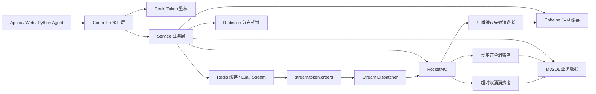
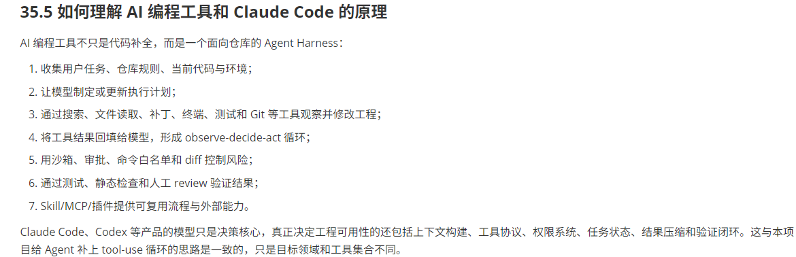
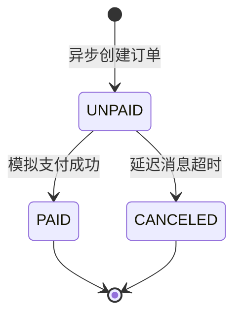

# ModelHub Java 项目架构与实现说明

## 1. 项目定位

`token-java` 是 ModelHub 的核心业务后端，负责保存和处理具有强一致性要求的业务事实：

- AI 模型目录、价格、热度和分类查询。
- Token 套餐与限时套餐库存。
- 高并发套餐秒杀和异步订单创建。
- 模拟支付、Token 额度发放和审计流水。
- 未支付订单超时取消及 Redis/MySQL 库存补偿。
- Caffeine + Redis 多级缓存及 RocketMQ 广播失效。
- 用户验证码登录和 Redis token 会话。

Python Agent 通过 HTTP 读取 Java 提供的模型、套餐、订单和额度数据。Java 不负责调用大模型，也不直接连接 Milvus；Milvus、RAG、记忆和自然语言编排属于 `token-agent`。

## 2. 总体架构



## 3. 技术栈

| 技术 | 当前版本/用途 |
| --- | --- |
| JDK | 25 |
| Spring Boot | 4.0.4，Web、依赖注入、事务和配置 |
| MyBatis-Plus | 3.5.15，实体映射、分页和条件更新 |
| MySQL | 模型、套餐、库存、订单和额度账本 |
| Spring Data Redis | 缓存、登录态、Lua、Stream、ID 自增 |
| Redisson | 用户维度订单锁、缓存重建锁 |
| Caffeine | 热门榜单与热门模型详情的 JVM 一级缓存 |
| RocketMQ | 异步订单、延迟取消、广播缓存失效 |
| Hutool | JSON、Bean 转换、随机验证码 |
| Lombok | 实体和消息对象样板代码 |

默认服务地址：

| 服务 | 地址 |
| --- | --- |
| Java | `127.0.0.1:8081` |
| MySQL | `127.0.0.1:3306/modelhub` |
| Redis | `192.168.100.128:6379` |
| RocketMQ NameServer | `192.168.100.128:9876` |

配置均支持通过环境变量覆盖，具体见 `src/main/resources/application.yaml`。

## 4. 项目结构与类职责

### 4.1 完整目录结构

```text
src
├── main
│   ├── java/com/hmdp
│   │   ├── ModelHubApplication.java       Spring Boot 启动类
│   │   ├── config                         基础设施和 Web 配置
│   │   │   ├── CaffeineConfig.java
│   │   │   ├── MvcConfig.java
│   │   │   ├── MybatisConfig.java
│   │   │   ├── RedissonConfig.java
│   │   │   └── WebExceptionAdvice.java
│   │   ├── controller                     HTTP 接口入口
│   │   │   ├── AdminAiModelController.java
│   │   │   ├── AiModelController.java
│   │   │   ├── TokenOrderController.java
│   │   │   ├── TokenPackageController.java
│   │   │   └── UserController.java
│   │   ├── dto                            接口参数、用户上下文和统一响应
│   │   ├── entity                         MySQL 表实体
│   │   ├── mapper                         MyBatis-Plus 数据访问层
│   │   ├── mq                             RocketMQ 消息定义、发送和消费
│   │   ├── service                        业务接口
│   │   │   └── impl                       业务实现
│   │   └── utils                          缓存、登录、ID 和通用工具
│   └── resources
│       ├── application.yaml               服务和中间件配置
│       ├── db/modelhub.sql                数据库初始化脚本
│       ├── mapper                         XML Mapper 预留目录，当前为空
│       ├── token_seckill.lua              秒杀资格和库存原子预占
│       └── release_token_seckill.lua      取消订单后的 Redis 状态补偿
└── test/java/com/hmdp
    ├── service/impl                       模型缓存服务测试
    └── utils                              通用 CacheClient 测试
```

代码遵循典型调用方向：

```text
HTTP 请求
  → Controller
  → Service 接口
  → ServiceImpl 业务实现
  → Mapper / Redis / RocketMQ
  → MySQL 或异步消费者
```

Controller 不直接操作数据库或消息队列；它只负责接收参数并调用 Service。事务、缓存、库存、状态机和消息发送都放在 ServiceImpl 中。

### 4.2 启动类

| 类 | 作用 |
| --- | --- |
| `ModelHubApplication` | Java 服务启动入口。`@SpringBootApplication` 扫描 `com.hmdp` 下的组件；`@MapperScan` 注册 Mapper；`@EnableAspectJAutoProxy(exposeProxy = true)` 开启 Spring AOP 代理能力。 |

启动时除了创建普通 Spring Bean，还会完成以下动作：

1. 注册两个 Caffeine 缓存和缓存异步刷新线程池。
2. 创建 Redisson 客户端、MyBatis 分页插件和 MVC 拦截器。
3. 注册三个 RocketMQ 消费者。
4. `TokenOrderServiceImpl` 的 `@PostConstruct` 创建 Redis Stream 消费组并启动 Stream 转发线程。

### 4.3 controller：HTTP 接口入口

| Controller | 基础路径 | 主要接口 | 职责 | 是否需要登录 |
| --- | --- | --- | --- | --- |
| `AiModelController` | `/ai-model` | `GET /{id}`、`GET /hot`、`GET /search` | 查询模型详情、热门榜单和关键字搜索。详情内部自动区分普通模型和热门模型缓存策略。 | 否 |
| `AdminAiModelController` | `/admin/ai-model` | `PUT /admin/ai-model` | 更新模型名称、分类、价格、状态或热度；触发事务提交后的 Redis/Caffeine 失效和 MQ 广播。 | 是，但当前只校验登录，未做管理员角色鉴权 |
| `TokenPackageController` | `/token-package` | `GET /{id}`、`GET /hot`、`GET /model/{modelId}` | 查询 Token 套餐详情、热门套餐和指定模型可购买的套餐。 | 否 |
| `TokenOrderController` | `/token-order` | `POST /seckill/{packageId}`、`POST /pay/{orderId}`、`GET /{orderId}`、`GET /act/me` | 秒杀下单、模拟支付、查询本人订单和 Token 额度账户。 | 是 |
| `UserController` | `/user` | `POST /code`、`POST /login`、`GET /me` | 发送验证码、登录/自动注册，以及读取当前登录用户。 | 验证码和登录不需要；`/me` 需要 |

Controller 的边界：

- `@PathVariable` 接收模型、套餐或订单 ID。
- `@RequestParam` 接收分类、页码、手机号等简单参数。
- `@RequestBody` 接收登录表单和模型更新对象。
- 所有业务结果统一包装为 `Result`，Controller 本身不处理缓存和事务。

### 4.4 service：业务接口与实现

`service` 下的 `IxxxService` 是业务契约；`service/impl` 下的类提供具体实现。它们继承 MyBatis-Plus 的 `IService`/`ServiceImpl`，因此同时具备基础 CRUD 能力。

| Service 实现 | 对应接口 | 主要职责 |
| --- | --- | --- |
| `AiModelServiceImpl` | `IAiModelService` | 模型详情、热门榜单、搜索和更新。普通详情使用 Redis；达到热度阈值的详情增加 Caffeine；榜单使用 Caffeine + Redis 逻辑过期；更新成功后触发缓存失效和 MQ 广播。 |
| `AiModelCacheServiceImpl` | `AiModelCacheService` | 集中管理模型缓存失效。更新节点删除 Redis 详情、递增榜单版本并清理本机 Caffeine；MQ 消费节点只清理本机 Caffeine。 |
| `TokenPackageServiceImpl` | `ITokenPackageService` | 查询套餐；新增秒杀套餐时同时写普通套餐表、秒杀库存表和 Redis 初始库存。 |
| `SeckillTokenPackageServiceImpl` | `ISeckillTokenPackageService` | 提供 `tb_seckill_token_package` 的基础 CRUD，主要被订单和套餐服务用于扣减或恢复 MySQL 库存。 |
| `TokenOrderServiceImpl` | `ITokenOrderService` | 秒杀核心编排：Lua 预占、Stream 转发、RocketMQ 订单消费、Redisson 用户锁、MySQL 防超卖、订单状态机、支付、延迟取消和库存补偿。 |
| `TokenAccountServiceImpl` | `ITokenAccountService` | 查询当前用户额度；支付后给指定模型账户增加 Token 额度，并写入唯一订单额度流水保证幂等。 |
| `UserServiceImpl` | `IUserService` | 手机验证码登录。验证码和 token 会话存 Redis；手机号首次登录时自动创建用户。 |

几个重要方法的定位：

| 方法 | 用途 |
| --- | --- |
| `AiModelServiceImpl.queryDetail` | 查询详情并决定是否进入热门详情 Caffeine。 |
| `AiModelServiceImpl.queryHot` | 查询热门榜单，先读 Caffeine，再走 Redis 逻辑过期缓存。 |
| `AiModelServiceImpl.updateModel` | 在事务中更新模型，并在提交成功后失效缓存、发送广播。 |
| `TokenOrderServiceImpl.seckillPackage` | 校验套餐和活动时间，生成订单 ID，执行 Lua 原子预占。 |
| `TokenOrderServiceImpl.createTokenOrder` | RocketMQ 消费后写 MySQL 订单，并使用条件更新防止库存变成负数。 |
| `TokenOrderServiceImpl.payTokenOrder` | 将本人未支付订单 CAS 更新为已支付，并发放额度。 |
| `TokenOrderServiceImpl.releaseTimeoutOrder` | 延迟消息到期后取消未支付订单，同时补偿 MySQL 和 Redis 库存。 |
| `TokenAccountServiceImpl.grantFromPaidOrder` | 使用额度流水唯一约束和账户版本号实现幂等发放、乐观锁更新。 |

`TokenOrderServiceImpl` 中注入了 `@Lazy ITokenOrderService self`。消费者调用 `self.createTokenOrder` 时会经过 Spring 事务代理，确保 `@Transactional` 生效，而不是在类内部直接调用导致绕过代理。

### 4.5 mapper：数据库访问层

| Mapper | 对应实体/数据表 | 说明 |
| --- | --- | --- |
| `AiModelMapper` | `AiModel` / `tb_ai_model` | 模型基础 CRUD，复杂查询主要通过 Service 中的 LambdaQuery 构造。 |
| `TokenPackageMapper` | `TokenPackage` / `tb_token_package` | 除基础 CRUD 外，包含套餐表与秒杀表的联表查询，用于补充库存和活动时间。 |
| `SeckillTokenPackageMapper` | `SeckillTokenPackage` / `tb_seckill_token_package` | 秒杀活动和 MySQL 库存 CRUD。 |
| `TokenOrderMapper` | `TokenOrder` / `tb_token_order` | 订单保存、查询和条件状态更新。 |
| `TokenAccountMapper` | `TokenAccount` / `tb_token_account` | 用户模型额度账户 CRUD。 |
| `TokenQuotaRecordMapper` | `TokenQuotaRecord` / `tb_token_quota_record` | 额度变动流水查询和写入。 |
| `UserMapper` | `User` / `tb_user` | 用户手机号查询和自动注册。 |

目前只有 `TokenPackageMapper` 使用注解 SQL 实现联表查询，`resources/mapper` 是以后改成 XML SQL 时的预留目录。

### 4.6 entity：数据库实体

| 实体 | 代表的数据 | 关键字段 |
| --- | --- | --- |
| `AiModel` | 可查询、可购买额度的 AI 模型目录 | `provider`、`category`、`inputPrice`、`outputPrice`、`status`、`hotScore` |
| `TokenPackage` | 模型的 Token 额度商品 | `modelId`、`tokenQuota`、`payValue`、`validDays`、`type`；`stock/beginTime/endTime` 是联表查询得到的非表字段 |
| `SeckillTokenPackage` | 秒杀套餐活动和数据库库存 | `packageId`、`stock`、`beginTime`、`endTime` |
| `TokenOrder` | 用户购买订单 | `userId`、`packageId`、`quotaAmount`、`status`、`payTime` |
| `TokenAccount` | 用户在某个模型下的额度账户 | `totalQuota`、`usedQuota`、`expireTime`、`version` |
| `TokenQuotaRecord` | Token 额度审计流水 | `orderId`、`changeAmount`、`changeType`、`balanceAfter` |
| `User` | 登录用户 | `phone`、`nickName`、`icon` |

金额字段 `inputPrice`、`outputPrice` 和 `payValue` 均使用整数，避免浮点金额误差。订单状态约定为：`1` 未支付、`2` 已支付并发放、`4` 已取消。

### 4.7 dto：接口数据对象

| DTO | 作用 |
| --- | --- |
| `LoginFormDTO` | 接收手机号、验证码和预留密码字段；当前登录流程实际使用手机号和验证码。 |
| `UserDTO` | 登录态中的精简用户信息，只保留 `id`、昵称和头像，避免把密码等实体字段写入 Redis 或用户上下文。 |
| `Result` | 统一接口响应，包含 `success`、`errorMsg`、`data` 和可选 `total`。 |

典型成功响应：

```json
{
  "success": true,
  "data": {}
}
```

典型失败响应：

```json
{
  "success": false,
  "errorMsg": "model not found"
}
```

### 4.8 mq：RocketMQ 消息模块

每类消息通常由四部分组成：`Constants` 定义 Topic 和消费组，`Message` 定义消息体，`Producer` 负责发送，`Consumer` 负责消费。

| 类 | 作用 |
| --- | --- |
| `TokenOrderMqConstants` | 定义 `token-order-topic` 和订单消费组。 |
| `TokenOrderMessage` | 携带 `orderId`、`userId`、`packageId`。 |
| `TokenOrderProducer` | Redis Stream 消息转发成功前同步发送 RocketMQ 订单消息。 |
| `TokenOrderConsumer` | 集群消费订单消息，调用 `handleSeckillOrder` 创建 MySQL 订单。 |
| `TokenOrderTimeoutMqConstants` | 定义订单超时 Topic 和消费组。 |
| `TokenOrderTimeoutMessage` | 只携带需要检查的 `orderId`。 |
| `TokenOrderTimeoutProducer` | MySQL 订单事务提交后发送延迟消息；延迟秒数来自配置。 |
| `TokenOrderTimeoutConsumer` | 延迟到期后调用 `releaseTimeoutOrder`，已支付订单会直接忽略。 |
| `AiModelCacheMqConstants` | 定义模型缓存失效 Topic 和消费组。 |
| `AiModelCacheMessage` | 携带发生变更的 `modelId`。 |
| `AiModelCacheProducer` | 模型更新事务提交后发送缓存失效广播。 |
| `AiModelCacheConsumer` | 使用 `BROADCASTING` 模式，让每个 Java 实例清除自己的热门详情和榜单 Caffeine。 |

订单消息和超时消息采用默认集群消费，同一条消息只由消费组内一个实例处理；缓存消息采用广播消费，因为每个 JVM 都有独立的 Caffeine。

### 4.9 config：配置类

| 配置类 | 作用 |
| --- | --- |
| `CaffeineConfig` | 创建热门详情缓存、热门榜单缓存，以及逻辑过期异步刷新的受控线程池。 |
| `MvcConfig` | 注册 token 刷新拦截器和登录校验拦截器，并维护公开接口白名单。 |
| `MybatisConfig` | 注册 MyBatis-Plus MySQL 分页插件，使 `Page` 查询自动生成分页 SQL。 |
| `RedissonConfig` | 根据 Spring Redis 主机和端口创建单机模式 `RedissonClient`。 |
| `WebExceptionAdvice` | 捕获未处理的 `RuntimeException`，记录完整日志并向客户端返回统一失败结果。 |

`CaffeineConfig` 当前配置：

| Bean | Key/Value | 容量与过期时间 |
| --- | --- | --- |
| `hotAiModelDetailLocalCache` | `modelId → AiModel` | 最大 1000，写入 1 分钟后过期 |
| `hotAiModelListLocalCache` | `category:page → List<AiModel>` | 最大 500，写入 15 秒后过期 |
| `cacheRefreshExecutor` | 热门榜单异步刷新任务 | 核心线程 2、最大线程 4、队列 100 |

### 4.10 utils：通用工具

| 工具类 | 作用 |
| --- | --- |
| `CacheClient` | 封装 Redis 空值缓存、随机 TTL、Redisson 互斥重建、Double Check、榜单逻辑过期和异步刷新。 |
| `AiModelCacheKeys` | 集中定义模型详情、热门榜单、版本号和缓存锁 Key，避免业务代码散落字符串。 |
| `RedisConstants` | 定义验证码和登录 token 的 Redis Key 前缀与 TTL。 |
| `RedisIdWork` | 使用时间戳高位与 Redis 日自增序列低位生成分布式订单 ID。 |
| `RefreshTokenInterceptor` | 从 `authorization` 请求头读取 token，查询 Redis 用户 Hash，写入 `UserHolder` 并刷新有效期。 |
| `LoginInterceptor` | 检查 `UserHolder` 是否存在用户；未登录时直接返回 HTTP 401。 |
| `UserHolder` | 使用 `ThreadLocal<UserDTO>` 保存当前请求用户，请求结束时必须清理。 |
| `RegexPatterns` / `RegexUtils` | 手机号、邮箱和验证码格式校验。当前主要使用手机号校验。 |
| `PasswordEncoder` | 带随机盐的密码摘要工具；当前验证码登录流程没有使用，作为密码登录扩展预留。 |

### 4.11 resources：配置、SQL 和 Lua

| 文件 | 作用 |
| --- | --- |
| `application.yaml` | 配置 Java 端口、MySQL、Redis、RocketMQ、热门模型阈值和订单超时时间，支持环境变量覆盖。 |
| `db/modelhub.sql` | 创建 `modelhub` 数据库、7 张业务表、索引和演示数据。首次部署时执行。 |
| `token_seckill.lua` | 在 Redis 内原子执行库存检查、一人一单检查、库存扣减、买家集合写入和 Stream 事件追加。 |
| `release_token_seckill.lua` | 取消订单时先从买家集合移除用户，成功移除后再恢复 Redis 库存，保证重复补偿不重复加库存。 |
| `resources/mapper` | MyBatis XML 预留目录；当前没有 XML 文件。 |

Lua 返回值约定：

| 返回值 | 含义 |
| --- | --- |
| `0` | 预占成功 |
| `1` | Redis 库存不足 |
| `2` | 用户已经预占过该套餐 |

### 4.12 test：当前自动化测试

| 测试类 | 覆盖内容 |
| --- | --- |
| `CacheClientTest` | 空值命中、数据库空结果缓存、随机 TTL、榜单逻辑过期、旧值返回和异步刷新。 |
| `AiModelServiceImplCacheTest` | 热门详情进入 Caffeine、普通详情不进入 Caffeine、榜单本地缓存命中后不访问 Redis。 |
| `AiModelCacheServiceImplTest` | 本地广播只清 JVM 缓存，以及更新时 Redis 详情删除和榜单版本递增。 |

当前共有 11 个单元测试。执行 `mvn test` 时不要求真实连接 MySQL、Redis 或 RocketMQ；中间件完整链路仍需要按第 20 节进行集成测试。

### 4.13 常见业务调用链与代码入口

| 想了解或修改的业务 | 从哪里开始看 | 后续核心类 |
| --- | --- | --- |
| 模型详情 | `AiModelController.detail` | `AiModelServiceImpl.queryDetail` → `CacheClient` → `AiModelMapper` |
| 热门榜单 | `AiModelController.hot` | `AiModelServiceImpl.queryHot` → Caffeine → `CacheClient.queryListWithLogicalExpire` |
| 模型更新 | `AdminAiModelController.update` | `AiModelServiceImpl.updateModel` → `AiModelCacheServiceImpl` → `AiModelCacheProducer/Consumer` |
| 登录鉴权 | `UserController` | `UserServiceImpl` → `RefreshTokenInterceptor` → `LoginInterceptor` → `UserHolder` |
| 套餐查询 | `TokenPackageController` | `TokenPackageServiceImpl` → `TokenPackageMapper` |
| 秒杀入口 | `TokenOrderController.seckill` | `TokenOrderServiceImpl.seckillPackage` → `token_seckill.lua` → Redis Stream |
| 异步创建订单 | Redis Stream 转发线程 | `TokenOrderProducer` → `TokenOrderConsumer` → `TokenOrderServiceImpl.createTokenOrder` |
| 支付发额度 | `TokenOrderController.pay` | `TokenOrderServiceImpl.payTokenOrder` → `TokenAccountServiceImpl.grantFromPaidOrder` |
| 超时取消 | `TokenOrderTimeoutConsumer` | `TokenOrderServiceImpl.releaseTimeoutOrder` → MySQL 恢复库存 → `release_token_seckill.lua` |

如果要新增一个普通业务接口，通常按下面顺序修改：

1. 在 `controller` 增加 HTTP 路由和参数。
2. 在对应 `IxxxService` 增加业务方法。
3. 在 `ServiceImpl` 实现校验、事务和业务编排。
4. 需要数据库操作时复用 `BaseMapper`，复杂 SQL 再添加 Mapper 方法。
5. 需要异步解耦时增加 MQ Constants、Message、Producer 和 Consumer。
6. 最后在 `src/test` 增加对应测试，并同步更新本文档的接口和流程说明。

## 5. 用户登录和接口鉴权

### 5.1 验证码

```text
POST /user/code
  → 校验手机号格式
  → 生成 6 位验证码
  → 写入 login:code:{phone}
  → TTL 2 分钟
  → 演示环境输出到 Java 日志
```

当前没有接入真实短信平台。

### 5.2 登录

```text
POST /user/login
  → 校验验证码
  → 按手机号查询用户
  → 不存在则自动注册
  → 生成 UUID token
  → UserDTO 写入 Redis Hash
  → token TTL 600 分钟
```

登录请求头使用原始 token：

```http
authorization: token值
```

不要添加 `Bearer` 前缀。

### 5.3 拦截器顺序

1. `RefreshTokenInterceptor` 顺序为 0，先读取 Redis token，把用户写入 `UserHolder`，并刷新 TTL。
2. `LoginInterceptor` 顺序为 1，检查当前线程是否存在登录用户，不存在时返回 HTTP 401。
3. 请求完成后清除 ThreadLocal，避免线程复用导致用户串号。

公开路径：

- `/ai-model/**`
- `/token-package/**`
- `/user/code`
- `/user/login`

订单、额度、当前用户和管理接口需要登录。

## 6. AI 模型查询与多级缓存

### 6.1 模型详情

```text
GET /ai-model/{id}
  → 热门详情 Caffeine（只有 hot_score 达到阈值时才可能命中）
  → Redis
  → Redisson 缓存重建锁
  → MySQL
  → 回填 Redis
  → 若 hot_score >= 8000，再回填热门详情 Caffeine
```

缓存配置：

| 层级 | Key | TTL |
| --- | --- | --- |
| 热门详情 Caffeine | `modelId` | 固定 1 分钟，最大 1000 个，只缓存热度达到阈值的模型 |
| Redis 正常数据 | `cache:ai-model:{id}` | 10～15 分钟随机 TTL |
| Redis 空值 | `cache:ai-model:{id}`，值为空字符串 | 2～4 分钟随机 TTL |
| Redis 重建锁 | `lock:cache:ai-model:{id}` | 等待 1 秒，租约 10 秒 |

默认阈值为 `8000`，可通过环境变量 `AI_MODEL_HOT_SCORE_THRESHOLD` 调整。普通详情不会写入 Caffeine，但仍会使用 Redis。只有 `status = 1` 的模型会对外返回。

推荐的缓存分工：

| 查询场景 | Caffeine | Redis | MySQL | 当前策略 |
| --- | --- | --- | --- | --- |
| 热门模型榜单 | 必须 | 必须 | 最终数据源 | Caffeine + Redis 逻辑过期 + 异步刷新 |
| 普通模型详情 | 不使用 | 保留 | 最终数据源 | Redis 空值缓存 + 随机 TTL + 互斥回源 |
| 热门模型详情 | 使用 | 必须 | 最终数据源 | Caffeine + Redis + 主动失效 |
| 价格、状态校验 | 不作最终依据 | 可辅助 | 必须最终校验 | 下单时重新校验 |

### 6.2 缓存穿透

不存在的模型第一次查询会访问 MySQL，并把空字符串写入 Redis。后续请求命中空值后直接返回 `model not found`，不会反复访问数据库。

空值使用较短 TTL，避免数据库后来新增相同 ID 后长期查询不到。

### 6.3 缓存雪崩

Redis 缓存不使用完全相同的固定过期时间：

- 模型详情基础 TTL 10 分钟，增加 0～5 分钟随机值。
- 空值基础 TTL 2 分钟，增加 0～2 分钟随机值。
- 热门榜单逻辑 TTL 60 秒，增加 0～30 秒随机值；Redis 物理 TTL 为 10 分钟。

随机抖动会把 Key 的失效时间分散开，避免大量缓存同时过期后集中请求 MySQL。

### 6.4 缓存击穿

模型详情 Redis 未命中时，使用 `lock:cache:ai-model:{id}` Redisson 锁进行互斥回源：

```text
第一次检查 Redis
  → 获取锁
  → Double Check Redis
  → 查询 MySQL
  → 回填缓存
  → 释放锁
```

Double Check 可以防止等待锁的线程再次访问数据库。锁设置 10 秒租约，修复了旧版简单 Redis 锁无 TTL 时可能形成死锁的问题。

### 6.5 热门模型榜单

```text
GET /ai-model/hot?category=reasoning&current=1
  → Caffeine（分类 + 页码，15 秒）
  → 未命中后读取热门榜单版本号
  → 拼接版本、分类和页码
  → 查询 Redis 逻辑过期数据
  → 未过期：返回榜单
  → 已过期：立即返回旧榜单，后台线程抢 Redisson 锁异步刷新
  → 完全不存在：抢 Redisson 锁同步查询 MySQL，完成首次构建
  → 按 hot_score 倒序并回填 Redis、Caffeine
```

热门榜单的逻辑过期时间为 60～90 秒，物理过期时间为 10 分钟。逻辑过期后旧数据仍然存在，因此刷新期间不会让高并发请求同时落到 MySQL。异步刷新使用受 Spring 管理的线程池，单实例还会合并相同 Key 的重复刷新任务。

Key：

```text
cache:ai-model:hot:version
cache:ai-model:hot:{version}:{category}:{page}
lock:cache:ai-model:hot:{version}:{category}:{page}
```

模型搜索 `/ai-model/search` 当前直接查询 MySQL，不使用缓存。

### 6.6 动态热度分

`hot_score` 不再只依赖初始化脚本或人工赋值，而是由近期行为定时计算并持久化到 `tb_ai_model`。当前使用两个指标来源：

- 详情访问：`GET /ai-model/{id}` 成功返回时记录。
- 购买量：订单从待支付成功更新为已支付，且支付事务提交后记录。

项目现已由 Java 网关在服务端发起真实模型调用，并记录供应商返回的 Token usage；这些调用记录用于额度结算和成本展示。动态热度分仍只使用详情访问和已支付购买量，尚未把模型调用量纳入评分。

为了不让热点详情每次命中 Caffeine 后又同步访问 Redis，事件先累计在各 JVM 的原子计数器中，默认按约 1 秒的固定延迟合并写入两个按 UTC 小时分桶的 Redis ZSet：

```text
metrics:ai-model:view:{yyyyMMddHH}
metrics:ai-model:purchase:{yyyyMMddHH}
```

ZSet member 为 modelId，score 为该模型在该小时内的累计次数，默认保留 72 小时。该聚合链路不保证 exactly-once：进程异常退出会丢失尚未落盘的本地累计量，响应不确定的 Redis 写重试也可能重复计数。

默认每小时第 5 分钟计算一次，最近 24 个完整小时为近期窗口，前 24 个小时为对照窗口。每个小时的数据先按 12 小时半衰期计算：

```text
decay = 0.5 ^ (ageHours / halfLifeHours)
signal = min(1, log1p(decayedCount) / log1p(saturation))
activity = 0.35 * viewSignal + 0.50 * purchaseSignal
growth = clamp(((recentActivity - previousActivity) / previousActivity) / 3, -1, 1)
hotScore = round(10000 * clamp(activity + 0.15 * growth, 0, 1))
```

对照窗口为 0、近期有行为时增长信号按 1 处理；两个窗口都为 0 时热度为 0。购买、详情访问和增长率的默认权重分别为 50%、35%、15%。权重、窗口、半衰期、两类饱和值、最大增长率、刷新 Cron 和总分上限均可在 `modelhub.hot-score` 下配置。

多实例部署时，刷新任务通过 `lock:ai-model:hot-score:refresh` Redisson 锁保证只有一个实例计算。任务只更新分值变化的模型；事务提交后批量删除相关详情缓存、只递增一次榜单版本，再逐模型发送 RocketMQ 广播清理其他实例的 Caffeine。

## 7. 模型更新与 RocketMQ 广播缓存失效

```text
PUT /admin/ai-model
  → 更新 tb_ai_model
  → MySQL 事务提交
  → 删除当前实例热门详情和热门榜单 Caffeine
  → 删除 Redis 模型详情
  → 热门榜单版本号递增
  → 发送 ai-model-cache-topic
  → BROADCASTING 广播到所有 Java 实例
  → 每个实例删除自己的热门详情和热门榜单 Caffeine
```

广播消费者只清理本实例的 Caffeine，不再重复删除 Redis 或递增榜单版本。共享 Redis 失效只由更新请求所在实例执行一次，避免实例数量越多、版本号一次更新递增越多。

热门榜单不使用 `KEYS cache:ai-model:hot:*` 扫描删除，而是递增版本号。旧版本缓存不再被请求，并在自身 TTL 到期后自然回收。

当前更新链路只覆盖应用接口。直接执行 SQL 不会发送消息；若需要捕获数据库外部更新，应接入 Canal/binlog、Debezium 或 Outbox。

## 8. Token 套餐

套餐类型：

```text
type = 0：普通 Token 套餐
type = 1：限时秒杀套餐
```

`tb_token_package` 保存模型、额度、价格、有效期和规则；`tb_seckill_token_package` 保存秒杀库存和活动时间。

套餐详情使用 LEFT JOIN 返回库存和活动时间。`addSeckillPackage()` 可以同时写 MySQL 套餐、秒杀库存和 Redis 库存，但目前没有暴露管理 Controller。

## 9. 秒杀入口和 Lua 原子预占

```text
POST /token-order/seckill/{packageId}
  → 校验套餐类型
  → 校验开始和结束时间
  → Redis 生成全局订单 ID
  → 执行 token_seckill.lua
```

Lua 在 Redis 内原子执行：

1. 检查 `token:stock:{packageId}` 是否有库存。
2. 检查 `token:order:{packageId}` 是否已经包含当前用户。
3. Redis 库存减一。
4. 用户 ID 写入已购买集合。
5. 使用 `XADD` 写入 `stream.token.orders`。

返回值：

| 返回值 | 含义 |
| ---: | --- |
| 0 | Redis 预占成功 |
| 1 | 库存不足 |
| 2 | 用户重复购买 |

接口返回订单 ID 只代表取得下单资格，MySQL 订单仍由后台异步创建。

## 10. Redis Stream 与 RocketMQ 异步订单

```text
Redis Lua
  → stream.token.orders
  → Dispatcher XREADGROUP
  → syncSend token-order-topic
  → 发送成功后 XACK
  → RocketMQ TokenOrderConsumer
```

应用启动时使用 `MKSTREAM` 自动创建：

```text
Stream：stream.token.orders
Group：token-g1
Consumer：token-c1
```

Stream 使“Redis 库存预扣”和“订单事件写入”处于同一次 Lua 原子操作中。RocketMQ 负责跨实例消费和失败重试。

只有 RocketMQ 同步发送成功后才 ACK Stream；发送失败的记录留在 pending-list，后台逻辑会尝试补偿处理。

## 11. MySQL 订单创建与防超卖

RocketMQ 订单消费者执行：

```text
TokenOrderConsumer
  → 用户维度 Redisson 锁
  → 事务代理 createTokenOrder
  → 检查订单 ID
  → 检查用户/套餐重复订单
  → MySQL stock > 0 条件扣减
  → 创建 UNPAID 订单
  → 事务提交后发送延迟取消消息
```

防重复与防超卖层次：

1. Lua 一人一套餐判断。
2. 用户维度 Redisson 分布式锁。
3. 订单 ID 幂等检查。
4. MySQL 用户/套餐重复订单检查。
5. `stock > 0` 条件更新防止数据库库存负数。
6. RocketMQ 消费失败重试。

## 12. 订单状态机



| 数值 | 状态 | 含义 |
| ---: | --- | --- |
| 1 | UNPAID | 未支付 |
| 2 | PAID | 已支付并发放额度 |
| 4 | CANCELED | 已取消并恢复库存 |

支付和超时取消都使用带 `status = UNPAID` 条件的更新，因此并发发生时只有一个状态迁移能够成功。

## 13. 支付与 Token 额度发放

```text
POST /token-order/pay/{orderId}
  → 查询订单
  → 校验订单归属
  → CAS：UNPAID → PAID
  → 查询套餐对应模型和有效期
  → 更新 tb_token_account
  → 写入 tb_token_quota_record
  → 事务提交
```

当前接口是模拟支付，不是真实第三方支付回调。

额度发放幂等机制：

- `tb_token_quota_record.order_id` 唯一。
- 发放前先按订单 ID 查询流水。
- 账户更新使用 `version` 乐观锁。
- 支付状态、账户更新和额度流水处于同一个事务。

额度到期时间按照 `max(当前时间, 原到期时间) + 套餐有效天数` 延长，连续购买不会丢失尚未到期的有效期。

## 14. 超时取消和库存补偿

订单创建事务提交后发送 `token-order-timeout-topic` 延迟消息。默认超时为 1800 秒，本地演示可通过 `TOKEN_ORDER_TIMEOUT_SECONDS` 缩短。

```text
延迟消息到期
  → 只处理 UNPAID
  → CAS：UNPAID → CANCELED
  → MySQL 库存加一
  → release_token_seckill.lua
  → 删除用户购买资格
  → Redis 库存加一
```

释放 Lua 只有在 `SREM` 确实删除用户资格时才增加 Redis 库存，重复执行不会重复加库存。

## 15. RocketMQ Topic

| Topic | Consumer Group | 模式 | 作用 |
| --- | --- | --- | --- |
| `token-order-topic` | `token-order-consumer-group` | CLUSTERING | 异步创建套餐订单 |
| `token-order-timeout-topic` | `token-order-timeout-consumer-group` | CLUSTERING + 延迟 | 取消超时订单 |
| `ai-model-cache-topic` | `ai-model-cache-consumer-group` | BROADCASTING | 清理全部实例模型缓存 |

## 16. Redis Key

| Key | 类型 | 作用 |
| --- | --- | --- |
| `login:code:{phone}` | String | 登录验证码 |
| `login:token:{token}` | Hash | 登录用户会话 |
| `cache:ai-model:{id}` | String/JSON | 模型详情或空值标记 |
| `lock:cache:ai-model:{id}` | Redisson Lock | 热点详情缓存重建 |
| `cache:ai-model:hot:version` | String/Long | 热门榜单版本 |
| `cache:ai-model:hot:{version}:{category}:{page}` | String/JSON | 热门榜单分页 |
| `lock:cache:ai-model:hot:{version}:{category}:{page}` | Redisson Lock | 热门榜单首次构建和异步刷新锁 |
| `token:stock:{packageId}` | String/Long | 秒杀 Redis 库存 |
| `token:order:{packageId}` | Set | 已预占套餐的用户 |
| `stream.token.orders` | Stream | Redis 秒杀订单事件 |
| `lock:token-order:{userId}` | Redisson Lock | 用户订单创建锁 |
| `icr:token-order:{date}` | String/Long | 分布式订单 ID 日序列 |

## 17. MySQL 数据表

| 表 | 作用 |
| --- | --- |
| `tb_user` | 用户和手机号 |
| `tb_ai_model` | 模型目录、价格、状态、热度 |
| `tb_token_package` | Token 套餐 |
| `tb_seckill_token_package` | 秒杀库存和活动时间 |
| `tb_token_order` | 订单和状态机 |
| `tb_token_account` | 用户模型额度账户 |
| `tb_token_quota_record` | 额度变更审计流水 |

完整初始化脚本：`src/main/resources/db/modelhub.sql`。

## 18. HTTP 接口

| 方法 | 接口 | 登录 | 说明 |
| --- | --- | --- | --- |
| POST | `/user/code` | 否 | 获取验证码 |
| POST | `/user/login` | 否 | 登录并返回 token |
| GET | `/user/me` | 是 | 当前用户 |
| GET | `/ai-model/{id}` | 否 | 模型详情，多级缓存 |
| GET | `/ai-model/hot` | 否 | 热门模型榜单 |
| GET | `/ai-model/search` | 否 | 模型搜索 |
| PUT | `/admin/ai-model` | 是 | 更新模型并广播失效缓存 |
| GET | `/token-package/{id}` | 否 | 套餐详情 |
| GET | `/token-package/hot` | 否 | 热门套餐 |
| GET | `/token-package/model/{modelId}` | 否 | 模型对应套餐 |
| POST | `/token-order/seckill/{packageId}` | 是 | Redis 秒杀预占 |
| GET | `/token-order/{orderId}` | 是 | 查询本人订单 |
| POST | `/token-order/pay/{orderId}` | 是 | 模拟支付并发放额度 |
| GET | `/token-order/account/me` | 是 | 查询本人额度账户 |

统一响应：

```json
{
  "success": true,
  "errorMsg": null,
  "data": {},
  "total": null
}
```

## 19. 一致性和幂等性总结

- Redis Lua 保证库存、限购和 Stream 写入原子执行。
- Stream 发送 RocketMQ 成功后才 ACK。
- RocketMQ 支持订单消费重试和延迟消息。
- Redisson 用户锁降低重复订单并发。
- MySQL 条件更新保证库存不小于零。
- 订单状态 CAS 保证支付和超时互斥。
- 额度流水唯一约束保证同一订单只到账一次。
- 账户版本号提供乐观并发控制。
- 释放 Lua 保证 Redis 库存补偿幂等。
- 模型更新在事务提交后删除缓存并发送广播。
- 空值缓存防穿透，随机 TTL 防雪崩，互斥回源防击穿。

## 20. 测试建议

### 20.1 缓存穿透

连续请求不存在的模型：

```http
GET /ai-model/999999
```

Redis 应出现空值 Key：

```text
cache:ai-model:999999
```

后续请求不再访问 MySQL，Key TTL 应位于 2～4 分钟。

### 20.2 随机 TTL

分别查询多个模型后检查：

```bash
TTL cache:ai-model:1
TTL cache:ai-model:2
TTL cache:ai-model:3
```

各详情 Key TTL 应分布在 10～15 分钟附近，而不是完全相同。

热门榜单 Key TTL 应分布在 60～90 秒。

### 20.3 广播缓存失效

1. 请求模型详情和热门榜单进行缓存预热。
2. 调用 `PUT /admin/ai-model` 修改价格或热度。
3. 查看 `received AI model cache invalidation broadcast` 日志。
4. 再次查询，应立即得到新数据。

### 20.4 秒杀闭环

```text
验证码登录
→ 秒杀 packageId=1
→ 查询异步订单
→ 默认 1800 秒内支付（本地可缩短）
→ 查询额度账户
```

再使用另一个用户秒杀但不支付，等待超时后验证订单状态为 4，并检查 Redis/MySQL 库存恢复。

缓存单元测试位于 `src/test/java/com/hmdp/utils/CacheClientTest.java`。

## 21. 当前边界和后续改进

1. 管理接口只有登录校验，没有管理员 RBAC。
2. 验证码输出日志，没有短信服务、频率限制和防刷。
3. 支付是模拟接口，没有真实支付回调、签名和退款。
4. 模型网关首版只支持 OpenAI 兼容的纯文本、非流式 Chat Completions。
5. 直接修改 MySQL 不会发送缓存失效消息。
6. 数据库事务和 RocketMQ 消息之间没有 Outbox 或事务消息。
7. Stream Consumer 名固定为 `token-c1`，多实例应改为实例唯一名称。
8. 热门榜单采用页码分页，但当前响应不返回 `total`。
9. 供应商适配当前是单一 OpenAI 兼容上游，多供应商路由和熔断尚未实现。
10. 缺少 MQ 死信告警、定时对账和完整基础设施集成测试。

## 22. 项目一句话介绍

> ModelHub Java 后端是平台的交易事实中心：使用 Caffeine 承接热门榜单和热门模型详情，使用 Redis 空值缓存、随机 TTL、逻辑过期与 Redisson 互斥重建支撑高并发查询，并通过 RocketMQ 广播维护多实例本地缓存一致性；秒杀侧使用 Redis Lua 和 Stream 原子预占库存，再由 RocketMQ、Redisson 与 MySQL 完成异步订单、防超卖、支付状态机、Token 额度幂等发放和超时库存补偿。
